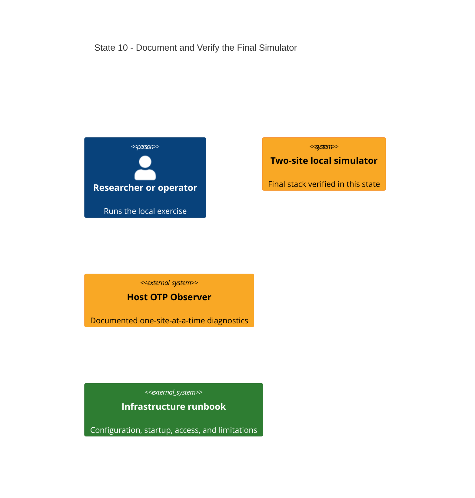

# State 10: Operational Handoff and Final Acceptance

Duration: 1-2 hours.

Depends on: State 09.

## Outcome

Remove stale documentation and configuration references, document the final
local workflow and Observer boundary, and perform one clean end-to-end apply.
This state adds no runtime feature. It turns the implemented stack into the
reviewed, repeatable local simulator described by the design.

## Incremental C4



The operator uses the runbook to start the simulator and one hidden Observer
process for the selected site. Relationships are stated here instead of drawn
because this state changes documentation and verification, not runtime wiring.

## Terraform delta

```text
infra/
├── = deployments/thesis-lab.tfvars             # final common source
├── = modules/common/deployment_config/          # final shared contract
├── ~ environments/local/outputs.tf              # final available endpoints and node names
├── ~ environments/local/terraform.sh             # final documented invocation
└── - any stale scalar, .env, central-collector, or host-port reference found by review

docs/
├── ~ infrastructure.md                          # purpose, operation, Observer, limits
└── ~ inprogress/cloud-evaluation-runbook.md     # remove stale local container and analysis checks
```

## Changes

1. Remove stale scalar-variable, `.env`, production-mode, central-collector,
   direct analysis-port, and removed host-port references.
2. Keep documentation focused on why the simulator exists, how to select and
   inspect a site, and what Docker does not emulate.
3. Document the fixed common manifest and vertical local component objects.
4. Document secret directory/file permissions without copying secret values.
5. Document the five host entry points from Terraform outputs.
6. Document Host Observer startup with an absolute per-site cookie directory,
   a hidden long-name node, and one site per process. State that Observer has
   full control of the selected site and plain distribution is local-only.
7. Document `docker exec` as the in-container fallback.
8. Document that Grafana is the central all-site view while LiveDashboard and
   Observer are site-local.
9. Document healthcheck limits, including collector config validation.
10. Remove hard-coded local container names and direct analysis host checks from
    the cloud evaluation runbook.
11. Perform a clean plan and apply from the final checked-in configuration.

## Destructive effects

The final clean apply can replace local resources whose names or network
attachments differ from an earlier state. No Terraform state migration or local
telemetry preservation is required. PostgreSQL volume destruction requires an
explicit review because it is not part of this handoff.

## Review gate

Review the complete diff from the implementation branch against the approved
design and all ten state files. Check every Terraform output, host port, network
attachment, secret mount, role, and deferred feature statement. Confirm the
documentation does not duplicate values that are easier to read from config.

## Working-state gate

- Terraform formatting and validation pass.
- All existing application checks pass.
- A final Terraform plan contains no unexplained destroy or replacement.
- Terraform apply completes from State 09.
- Every long-running container is healthy and every one-shot exits zero.
- Outputs list only available endpoints and both site coordinator node names.
- The repository contains no stale `.env` requirement, legacy collector config,
  or obsolete scalar configuration surface.

## Final state

The local Docker environment now exercises the selected multi-site and
multi-cloud-like boundaries. It remains a local approximation and does not
replace tests on real provider infrastructure.
