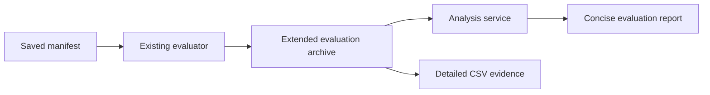

# Evaluation Phase 1

## Design

Phase 1 completes the evidence produced by one saved evaluation manifest. The
runner continues to execute only the source, matrix, seeds, and trial count in
that manifest. It does not manage a study, choose tiers, run a warm-up pass, or
compare replicas.

The archive records the missing pre-attack and host outcomes. The analysis
service converts the archive into statistical and descriptive results. The
evaluation report shows only the feasibility and timing summaries required to
interpret a study result.

The archive adds these immutable evidence files:

- Required-flow status before attacks for the baseline and every selected plan.
- Host compromise status for every host in every attack trial.
- Total evaluator duration for the completed run.

The archive continues to contain plans, trial outcomes, capability outcomes,
the resolved manifest, graph input, and checksums. The analysis service derives
feasibility summaries, descriptive host probabilities, and timing summaries
from these files.

Phase 1 does not change the evaluation manifest schema. A researcher controls
the study by saving and running manifests. The researcher performs warm-up by
running the selected saved manifest once without using its duration or outcomes
as study evidence.

For a measured tier, the researcher generates a graph once, saves a manifest
that references its graph revision and entry-host ID, then runs that same saved
manifest. A portable generator-source manifest remains a recipe. The saved
graph-revision manifest is the measured input.

Phase 2 may add manifest import, graph-freeze, study-batch, and
cross-replica-validation commands. Phase 1 does not add this automation.

## Manual Study Procedure

1. Save a pilot manifest that names a generator source.
2. Run the pilot. Choose the host count and attack-trial count from its results.
3. Generate the selected graph once with the existing Mix task.
4. Save the measured manifest with the generated graph revision and entry-host
   ID.
5. Run the saved measured manifest once as warm-up.
6. Run the same saved manifest five times for timing.
7. Analyze the first timed archive for outcome evidence.
8. Calculate each tier timing result from the five analysis runtime summaries.
9. Run the separate feasibility manifest on the existing order-fulfilment
   graph.

## Test Cases

- WHEN an evaluation archive is exported, THEN it contains one required-flow
  status for each declared capability flow in every experiment.
- WHEN an evaluation archive is exported, THEN it contains one host outcome for
  every host and declared trial in every experiment.
- WHEN an evaluation completes, THEN the archive contains its non-negative
  total evaluator duration.
- WHEN analysis receives a valid archive, THEN it reports feasibility,
  descriptive host probabilities, and the three runtime values.
- WHEN the evaluation report receives analysis data, THEN it shows concise
  feasibility and timing summaries.
- WHEN an archive omits or corrupts a new payload, THEN analysis rejects it.

## Execution

### Chunk 1: Archive Outcome Evidence

Extend the Elixir output contract with deterministic required-flow and
host-compromise outcome files. Reuse the existing experiment graph revisions,
attacker footholds, and mission-impact calculation. Extend the archive checksum
set and focused output-contract tests.

Files: `src/lib/network_defense/evaluation/output_contract.ex`, mission-impact
support as needed, and output-contract tests.

### Chunk 2: Total Evaluator Timing

Persist evaluator wall-clock duration only when a run completes. Export it as a
run-level archive file. Keep existing plan-selection and experiment simulation
durations unchanged. Add the database migration and focused persistence and
archive tests.

Files: evaluation-run migration and schema, evaluator, evaluation-runs context,
output contract, and evaluation tests.

### Review 1

Review the first two chunks for archive completeness, deterministic ordering,
database safety, resume behavior, and contract consistency before analysis work.

### Chunk 3: Analysis Outputs

Validate the new archive payloads. Produce required-flow and affected-capability
summaries, descriptive host probabilities, and one runtime summary for the
archive. Keep host results descriptive. Add analysis tests for valid data and
invalid coverage or checksums.

Files: `evaluation/analysis/src/network_defense_analysis/contracts.py`,
`report.py`, and analysis tests.

### Chunk 4: Concise Evaluation Report

Parse the analysis summaries into existing Elixir evaluation-report contracts.
Show feasibility and timing summaries in the evaluation analysis report. Keep
host detail in the archive and existing single-simulation heatmap. Update the
analysis guide and topology-scale protocol with the manual warm-up and freeze
procedure.

Files: evaluation analysis-result and web contracts, analysis report Svelte
components and tests, generated contracts, and study documentation.

### Review 2 And Verification

Review the analysis and report changes for compatibility with the archive
contract and the no-new-manifest-schema rule. Run focused Elixir and Python
tests, then run `mix precommit` and the complete analysis test suite.
