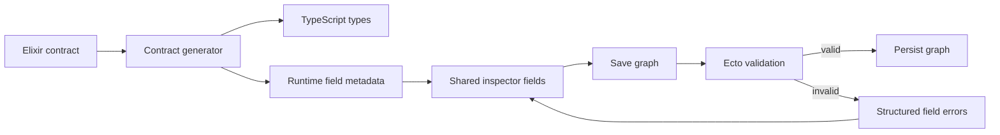

# Generated Inspector Design

## Design

Elixir contracts remain the source of field structure and validation. The TypeScript generator emits runtime metadata for field shape and enum choices. It does not emit validation rules.

The generated metadata contains field names, primitive kinds, nullability, enum choices, nested-contract references, and list item references. These facts come from existing typespecs and enum metadata.

The frontend owns labels, grouping, hidden fields, and custom controls. It uses defaults for ordinary fields. Mission capability required flows remain a custom control.

The frontend converts input text to the wire type. It does not enforce required fields, ranges, formats, or cross-field rules. The backend changesets validate all domain rules when the user saves the graph.

Save failures return stable errors with an entity kind, entity ID, field path, and message. The graph document stores these errors. The inspector displays errors for the selected entity and clears stale errors when that entity changes.

## Test Cases

- When a typespec contains a scalar field, the generator shall emit its runtime field kind.
- When a typespec contains a nullable field, the generator shall emit its nullability.
- When contract enum metadata exists, the generator shall emit the available choices.
- When a typespec references a nested contract or list item, the generator shall emit that reference.
- When graph validation fails, Save shall return the entity ID, field path, and validation message.
- When the selected entity has a validation error, the inspector shall display that error at the matching field.
- When the user changes an invalid entity, the document shall clear that entity's stale validation errors.
- When the selected field is a custom collection, the inspector shall use its custom control.

## Boundaries

Do not generate required-field, range, format, or cross-field validation rules. Do not add a frontend form framework. Do not change graph persistence semantics for valid graphs.
