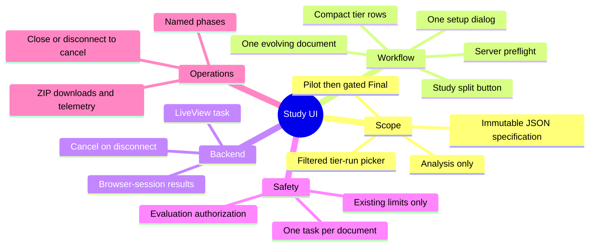

# Study UI

**Status:** Frozen by user decision.

```mermaid
flowchart LR
    A[Study split button] --> B[Study dialog]
    B --> C[Edit or open immutable JSON specification]
    C --> D[Map tiers with filtered run picker]
    D --> E[Server preflight]
    E --> F[Study document: Pilot running]
    F --> G[Pilot result and ZIP download]
    G -->|Valid recommendation| H[Run Final]
    H --> I[Final result and ZIP download]
```

## Agreed direction

Build this in two phases.

Phase 1 adds a manifest-style **Run study analysis** dialog. The user selects an immutable study-specification version, maps each tier to one completed evaluation run, passes server preflight, and starts Pilot. A valid Pilot enables Final in the same study document. The server calls the study-analysis domain service directly. It must not shell out to the Mix task.

Execution uses a LiveView-owned task. Results and exact run mappings remain in the browser document only. Pilot and Final ZIP downloads preserve the output before the document closes.

Phase 2 can orchestrate collection, topology freezing, warm-up, and tier evaluation after the cloud-study tooling and operational guardrails exist. Do not make Phase 1 look like it runs the entire study protocol.

This split uses the existing study bundle and result parser. It also avoids hiding expensive multi-run collection behind one button.

# Scope

## First release

### What does “run a study” mean?

The first release runs pilot or final study analysis over completed tier evaluation runs.

It does not create topologies, freeze graphs, warm up workers, or collect tier evaluations. Full orchestration remains a later phase because it needs cloud-run recovery, cost, and concurrency controls.

Rejected alternatives:

- Full orchestration: too much operational scope for the first release.
- Analysis plus collection: creates a misleading partial protocol because topology setup and warm-up remain manual.

### How is the study specification provided?

Use the same JSON workflow as the current evaluation manifest. The user can edit, validate, preview, save, and reopen a study specification. The UI and persistence model should follow `ManifestDialog.svelte` and the existing evaluation-manifest flow.

A study specification stays a separate contract and saved entity. It must not be embedded into an evaluation manifest.

### How are study specifications versioned?

Treat saved versions as immutable. After a version is used, edits create the next specification version under the same study identity. The Run tab always shows the exact version that will execute.

Rejected alternatives:

- Lock only after pilot: creates two save semantics for one entity.
- Free overwrite: breaks reproducibility and makes downloaded results hard to trace.

Rejected alternatives:

- Upload on every run: weak reuse and audit history.
- Repository-only files: too rigid for browser workflows.

### How are tier runs selected?

Use an open-style picker that lists evaluation-run documents. Filter it to completed runs that are compatible with the selected tier. Show enough metadata to distinguish runs without copying UUIDs.

The user makes every selection explicitly. The same run cannot satisfy two tiers because the study bundle requires unique run IDs.

Selected rows show metadata only: title, completion time, manifest, graph, and plan/trial counts. They do not open another workspace document in the first release.

Rejected alternatives:

- Automatic latest-run selection: silently changes study evidence.
- Pasted run IDs: error-prone and difficult to review.

# Workflow

### Where does the study workflow start?

Replace the standalone Open study results action with a Study split button. Its primary action opens Run study. Its menu contains Open study results for the existing read-only import flow.

Rejected alternatives:

- Two separate ribbon actions: consumes more space for one workflow family.
- Analysis menu: mixes evaluation-manifest analysis with cross-tier study analysis.

## Configuration

### How is setup organized?

Use one dialog that follows the evaluation-manifest pattern. It contains the study-specification JSON editor, structured preview, and a Run tab with tier rows and validation.

Rejected alternatives:

- Workspace setup document: heavier navigation for a bounded configuration task.
- Separate edit and launch dialogs: splits context and duplicates validation state.

### How is the tier mapping laid out?

Show a compact table with one row per declared tier. Each row shows the tier, required input shape, selected completed run, and a Choose or Change action. The action opens the shared filtered run-document picker.

Show row-specific validation below the affected row. Show a summary such as `3 of 3 tiers mapped` above the Run button.

The Run tab is the review surface. One explicit Run pilot click starts analysis. Do not add a second confirmation dialog. Run final from the validated pilot report without another confirmation dialog.

Pilot requires an immutable saved specification version. Unsaved edits disable Run. Changing or saving a new specification version clears tier mappings and any pilot state.

Rejected alternatives:

- Stacked cards: consume more space and weaken cross-tier comparison.
- Sequential wizard: hides the complete mapping until the review step.
- Multi-select assignment: makes tier mismatches easier.

When no completed run qualifies, explain the missing tier evidence and provide Open evaluation manifest. That action leaves study analysis setup intact and opens the existing evaluation workflow. Do not list incomplete runs as selectable evidence.

## Validation

### When is Final analysis available?

Final analysis requires a compatible successful pilot result for the same study-specification version and exact tier-run mapping.

Start Final from the pilot report. The pilot document retains the exact setup and enables Run final analysis only when the recommendation is valid. Keep Final disabled when the pilot is insufficient, non-informative, failed, cancelled, or stale. Explain the blocking state beside the control. Do not provide an override in the first release.

Allow the user to rerun an insufficient or non-informative pilot with identical inputs. State that deterministic inputs should reproduce the same stop condition. Keep this action distinct from retrying a transport or service error.

Run a read-only server preflight whenever the saved specification version or tier mapping changes. Enable Run pilot only when the server can validate and construct the complete study bundle. Repeat the same validation when execution starts; the preflight is not an authorization or integrity boundary.

Rejected alternatives:

- Expert override: weakens the frozen study protocol and adds audit complexity.
- Independent Final mode: permits final analysis with unapproved sample counts.

## Results

### How are Pilot and Final results organized?

Use one evolving study document. It moves through configured, pilot running, pilot complete, final running, and final complete states. After completion, Pilot and Final remain available as tabs in the same document.

Lock the specification version and tier mapping when Pilot starts. The document never edits those inputs afterward. Different inputs require a new study document.

The pilot tab preserves the recommendation that unlocked Final. The final tab presents the corrected comparison family. Shared study metadata appears once in the document header.

Use this document view for imported results too. Imported ZIPs open in read-only mode. Studies run in the current browser include setup identity, progress, downloads, and the gated Final action. Share one result renderer so imported and live results cannot drift.

Rejected alternatives:

- Separate documents: duplicates study context and weakens the pilot-to-final relationship.
- Replace pilot view: hides the evidence that unlocked Final.

### How are ephemeral results preserved?

Provide separate Download pilot ZIP and Download final ZIP actions when each result completes. The browser receives the original validated ZIP bytes, not a reconstructed archive.

The document can close only after warning about any completed result that has not been downloaded.

Rejected alternatives:

- Final-only download: loses the pilot evidence that authorized Final.
- Browser-only results: makes the study output disposable.

## Execution

### How does analysis execute?

Start analysis as a LiveView-owned task for the first release. Do not add Oban orchestration yet.

This keeps implementation small. Disconnect behavior and cancellation remain unresolved.

Rejected alternatives:

- Oban job: stronger recovery and history, but more schema and worker scope.
- Persisted supervised job: needs custom recovery logic without the queue benefits.

# Backend

## Persistence

### Where do pilot results live?

Keep the pilot result and its exact tier-run mapping in the open browser document only. A compatible successful pilot unlocks Final in that document. Changing the study specification or any tier selection immediately makes the pilot stale and disables Final.

Refresh, document close, or browser close loses the pilot and the Final gate. The user must run the pilot again. Imported pilot ZIPs remain view-only and cannot unlock Final because the current output contract does not identify exact tier runs.

Rejected alternatives:

- Persisted pilot records: more backend state than desired for the first release.
- Re-imported pilot as a gate: cannot prove exact tier-run identity with the current metadata.
- Weak metadata matching: can mix evidence from different tier runs.

## Recovery

### What happens on disconnect?

Cancel the LiveView-owned analysis task when the owning LiveView terminates. There is no persisted result owner or recovery path in the first release.

The UI must state that the browser document must remain open until analysis completes. A reconnect starts from the pre-run setup state and requires a new submission.

Rejected alternatives:

- Let the task finish: wastes analysis capacity and discards an unowned result.
- Reconnect grace: needs a temporary registry and reattachment protocol.

# Safety

## Authorization

### Who can run analysis?

Use the same authorization boundary as starting an evaluation. Do not add a study-specific role system in the first release.

Rejected alternatives:

- Administrator-only: inconsistent with existing evaluation operation.
- Local-only UI: prevents the intended deployed workflow.

## Concurrency

### How many analyses can run concurrently?

Allow one active analysis task per study document. A user can run different study documents concurrently, but Pilot and Final cannot overlap inside one document.

Rejected alternatives:

- One active task per dashboard session: blocks independent study documents.
- Unlimited tasks per document: permits duplicate and conflicting state transitions.

### How is service overload handled?

Add no study-specific concurrency limit or queue. Rely on the analysis service, existing archive-size limits, and request timeouts. Surface service rejection or timeout as a recoverable error in the owning document.

Rejected alternatives:

- Configurable app-node cap: additional admission-control state.
- In-memory queue: queued work disappears on restart and conflicts with ephemeral execution.

### What server-side history remains?

Persist no study-run or result records. Emit structured telemetry for start, completion, failure, cancellation, duration, study identity, specification version, mode, and tier count. Do not include archive contents.

Downloaded Pilot and Final ZIPs are the durable user-owned evidence.

Rejected alternatives:

- Minimal audit rows: introduces run persistence without result recovery.
- Ordinary logs only: weak operational visibility.

# Operations

## Progress

### What progress is shown?

Show named phases: Building bundle, Submitting analysis, Waiting for service, Validating result, and Complete. Show the active phase with an indeterminate indicator. Do not invent percentages because the analysis service does not expose internal progress.

Keep the last completed phase visible when an error occurs. Include the stable error code and a recovery action.

Rejected alternatives:

- Spinner only: provides weak diagnostics for long requests.
- Detailed service progress: requires a larger Python service protocol change.

### How are failures retried?

Keep the exact setup and completed prior phase in the study document. Show the stable error near the action and re-enable Run pilot or Run final. Clicking the action retries in place.

Do not retry automatically. Automatic retry needs failure classification, counters, backoff, and duplicate-request handling.

## Cancellation

### How can the user cancel?

Do not show an explicit Cancel action. Closing the running study document or disconnecting the LiveView cancels the task. Closing a running document first asks for confirmation and states that progress will be lost.

Rejected alternatives:

- Always-visible Cancel: adds a control the first release does not need.
- Cancel before submission only: creates inconsistent behavior between phases.
