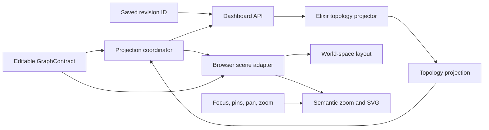

# Topology Projection Boundary Grilling

Topology Projection Boundary
├─ Authority
│  ├─ Semantic owner: Elixir projector [#](#semantic-owner)
│  ├─ Draft source: full graph [#](#draft-source)
│  └─ Failure path: last accepted model [#](#failure-path)
├─ Contract
│  ├─ Shape: normalized IDs [#](#projection-shape)
│  ├─ Workspace payload: graph plus projection
│  ├─ Draft reply: projection only
│  ├─ Freshness: semantic fingerprint
│  ├─ Partial graphs: best effort plus issues
│  ├─ Summary counts: server
│  ├─ Projection cache: none
│  ├─ Flow source: draft preview
│  └─ Result order: server stable
├─ Client
│  ├─ Geometry: browser [#](#geometry-owner)
│  ├─ Projection state: composed model
│  ├─ Interaction: browser local
│  ├─ Request timing: action-aware
│  ├─ Issue display: Unplaced tray [#](#issue-display)
│  ├─ Semantic input: projection roles only
│  └─ Rendering: browser local
└─ Migration
   ├─ Domain projector: graph domain
   ├─ Draft endpoint: replace saved-only fetch
   ├─ Delivery: coordinated cutover
   └─ TypeScript cleanup: ruthless purge

# Current Boundary

The server already loads a saved graph revision and materializes reachability in `DashboardLive.build_graph_projection/1`. Its reply contains segment IDs, host IDs, policy links, and operational flows.

The browser then performs domain interpretation in `NetworkCanvasProjection.ts`:

- It resolves segment membership.
- It resolves service and vulnerability ownership.
- It creates the synthetic unassigned segment.
- It groups segment policies.
- It joins and groups operational flows.
- It combines domain facts with names and positions.

This split is hard to read because the server owns the graph rules, but the browser reconstructs part of the same meaning. The progressive topology plan would add more browser-side classification unless the boundary changes.

# Proposed Architecture

The server owns semantic projection. The browser owns geometry and interaction.



## Server responsibilities

- Interpret segment, host, and service membership.
- Resolve context anchors from authored relationships.
- Represent unassigned and ambiguous entities without inventing graph nodes.
- Group segment policies, including self-policy.
- Materialize and group operational flows.
- Return stable IDs and semantic roles.
- Report projection issues for incomplete draft graphs.

## Browser responsibilities

- Join projection IDs with the editable `GraphContract`.
- Read names, fields, and persisted positions from the graph contract.
- Compute rectangles, pixel sizes, collision, and edge paths.
- Apply semantic zoom, hysteresis, focus lenses, and sticky pins.
- Handle pointer, keyboard, drag, connect, pan, zoom, and inspector state.
- Keep the last accepted projection while a new draft projection is pending.

The server must not know zoom thresholds, card dimensions, SVG paths, selected entities, or sticky pins.

# Interface Definitions

The names below define the proposed boundary. They do not require these exact module names.

```text
TopologyProjection
├─ segments[]
│  ├─ id
│  ├─ host_ids[]
│  └─ summary
│     ├─ host_count
│     ├─ service_count
│     └─ context_count
├─ hosts[]
│  ├─ id
│  ├─ segment_id | null
│  ├─ service_ids[]
│  └─ summary
│     ├─ service_count
│     └─ context_count
├─ services[]
│  ├─ id
│  └─ host_id | null
├─ attachments[]
│  ├─ id
│  ├─ node_type
│  └─ anchors[]
│     ├─ node_id
│     ├─ edge_id
│     └─ relationship_type
├─ policy_groups[]
│  ├─ from_segment_id
│  ├─ to_segment_id
│  └─ edge_ids[]
├─ flow_groups[]
│  ├─ source_host_id
│  ├─ target_host_id
│  ├─ service_ids[]
│  └─ flow_ids[]
└─ issues[]
   ├─ code
   ├─ severity
   ├─ entity_id
   └─ related_ids[]
```

`attachments.node_type` identifies vulnerability, credential, or mission capability. Each anchor identifies the authored edge and its generated relationship type. The server sorts every array and nested ID list deterministically.

The projection contains IDs, counts, and semantic relationships. It does not duplicate node names, data fields, positions, labels, or UI text from `GraphContract`.

The browser still needs the complete editable graph because it owns the unsaved document and inspector. Every supported entity can be edited, so a scene-only payload would omit required editor data.

## Open and save replies

```text
OpenGraphReply or SaveGraphReply
├─ status
├─ graph
└─ topology_projection
```

The graph and projection come from the same accepted domain graph. The browser does not make a second saved-projection request.

## Unsaved draft request

```text
ProjectTopologyDraft
├─ document_id
├─ semantic_version
└─ graph

ProjectTopologyDraftReply
├─ status
├─ document_id
├─ semantic_version
└─ topology_projection
```

A draft reply returns only the projection because the browser already has the graph. The browser applies the reply only when its document ID and semantic version still match. Position-only edits and view state do not increment the semantic version.

To stop sending the complete graph to the browser, inspector reads and edit commands must also move to the server. That is a separate server-authoritative editor redesign.

# Concrete Domain Interface

The projector is a pure graph-domain module:

```elixir
defmodule NetworkDefense.Graph.TopologyProjection do
  @type t :: %__MODULE__{
          segments: [Segment.t()],
          hosts: [Host.t()],
          services: [Service.t()],
          attachments: [Attachment.t()],
          policy_groups: [PolicyGroup.t()],
          flow_groups: [FlowGroup.t()],
          issues: [Issue.t()]
        }

  @spec project(Graph.t()) :: t()
end
```

`project/1` is total for a structurally valid graph. Missing or ambiguous semantic relationships produce projection issues. They do not return an error tuple. The projector reuses `MaterializeReachability` for draft flow previews and sorts every result.

The draft endpoint needs a domain graph but receives `GraphContract`. Add this conversion without changing the existing wire fields:

```elixir
@spec GraphContract.to_domain(GraphContract.t(), keyword()) ::
        {:ok, Graph.t()} | {:error, Ecto.Changeset.t()}
```

The draft handler calls `GraphContract.to_domain(graph, validate_membership: false)`. Node and edge contracts still validate their shape, data, endpoint existence, and relationship compatibility. Disabled membership validation lets the projector return Unplaced items and typed issues. A dangling edge remains `invalid_graph`; it is not a projection issue. Do not weaken `SaveGraphContract` or saved-revision validation.

# Concrete Wire Contracts

## Projection contracts

Add these generated contract modules under `NetworkDefenseWeb.Contracts.Dashboard.Graph`:

```elixir
TopologyProjection
├─ embeds_many :segments, TopologyProjectionSegment
├─ embeds_many :hosts, TopologyProjectionHost
├─ embeds_many :services, TopologyProjectionService
├─ embeds_many :attachments, TopologyProjectionAttachment
├─ embeds_many :policy_groups, TopologyProjectionPolicyGroup
├─ embeds_many :flow_groups, TopologyProjectionFlowGroup
└─ embeds_many :issues, TopologyProjectionIssue
```

The nested contract fields are:

```text
TopologyProjectionSegment
├─ id: UUID
├─ host_ids: UUID[]
├─ host_count: non-negative integer
├─ service_count: non-negative integer
└─ context_count: non-negative integer

TopologyProjectionHost
├─ id: UUID
├─ segment_id: UUID | null
├─ service_ids: UUID[]
├─ service_count: non-negative integer
└─ context_count: non-negative integer

TopologyProjectionService
├─ id: UUID
└─ host_id: UUID | null

TopologyProjectionAttachment
├─ id: UUID
├─ node_type: Vulnerability | Credential | MissionCapability
└─ anchors: TopologyProjectionAnchor[]

TopologyProjectionAnchor
├─ node_id: UUID
├─ edge_id: UUID
└─ relationship_type:
   HasVulnerability | StoresCredential | AuthenticatesTo | Supports

TopologyProjectionPolicyGroup
├─ from_segment_id: UUID
├─ to_segment_id: UUID
└─ edge_ids: UUID[]

TopologyProjectionFlowGroup
├─ source_host_id: UUID
├─ target_host_id: UUID
├─ service_ids: UUID[]
└─ flow_ids: UUID[]

TopologyProjectionIssue
├─ code:
│  host_without_segment
│  host_multiple_segments
│  service_without_host
│  service_multiple_hosts
│  context_without_anchor
├─ severity: info | warning
├─ entity_id: UUID
└─ related_ids: UUID[]
```

Shared context is not an error. An attachment can have several anchors. The projector emits an issue only when no valid placement exists or a single-owner relationship is ambiguous.

## Existing Open and Save replies

Extend the existing contracts. Do not change their status enums or graph fields:

```elixir
OpenGraphReply
├─ status                         existing
├─ graph: GraphContract | nil     existing
└─ topology_projection: TopologyProjection | nil  new

SaveGraphReply
├─ status                         existing
├─ graph: GraphContract | nil     existing
├─ errors: GraphValidationError[] existing
└─ topology_projection: TopologyProjection | nil  new
```

On `status == "ok"`, both `graph` and `topology_projection` are present and come from the same domain graph. Error replies omit both fields. Save validation errors keep their existing shape.

## New draft request and reply

```elixir
ProjectTopologyDraftPayload
├─ document_id: UUID
├─ semantic_version: non-negative integer
└─ graph: GraphContract

ProjectTopologyDraftReply
├─ status: ok | invalid_graph | unmapped_error
├─ document_id: UUID | nil
├─ semantic_version: integer | nil
├─ topology_projection: TopologyProjection | nil
└─ errors: GraphValidationError[]
```

`GraphContract` is intentional here. Unlike `SaveGraphContract`, its `revision_id` is optional, so it accepts a new unsaved graph. The handler does not persist the graph.

# Generated TypeScript Shapes

`mix gen.contracts` generates aliases in `contracts.generated/dashboard/graph.ts`. The effective interfaces are:

```typescript
interface TopologyProjection {
  segments: TopologyProjectionSegment[];
  hosts: TopologyProjectionHost[];
  services: TopologyProjectionService[];
  attachments: TopologyProjectionAttachment[];
  policy_groups: TopologyProjectionPolicyGroup[];
  flow_groups: TopologyProjectionFlowGroup[];
  issues: TopologyProjectionIssue[];
}

interface OpenGraphReply {
  status: "ok" | "stale" | "not_found" | "invalid_graph" | "unmapped_error";
  graph?: GraphContract | null;
  topology_projection?: TopologyProjection | null;
}

interface SaveGraphReply {
  status: "ok" | "stale" | "not_found" | "invalid_graph" | "unmapped_error";
  graph?: GraphContract | null;
  topology_projection?: TopologyProjection | null;
  errors?: GraphValidationError[] | null;
}

interface ProjectTopologyDraftPayload {
  document_id: string;
  semantic_version: number;
  graph: GraphContract;
}

interface ProjectTopologyDraftReply {
  status: "ok" | "invalid_graph" | "unmapped_error";
  document_id?: string | null;
  semantic_version?: number | null;
  topology_projection?: TopologyProjection | null;
  errors: GraphValidationError[];
}
```

The generated nested interfaces use required arrays. Nullable parent IDs remain optional and nullable, consistent with current generated contracts.

# Frontend State Interfaces

## Dashboard API

Keep the existing `openGraph` and `saveGraph` arguments. Their generated reply types gain `topology_projection`.

Delete `fetchGraphProjection`. Add:

```typescript
projectTopologyDraft(
  documentId: string,
  semanticVersion: number,
  graph: GraphContract,
): Promise<ProjectTopologyDraftReply>;
```

The implementation sends `project_topology_draft` with the generated payload. It does not reshape or interpret the graph.

## Composed projection model

Compose this state holder into `EditableGraphDocument`:

```typescript
type AcceptedTopologyProjection = {
  source: "revision" | "draft";
  semanticVersion: number;
  projection: TopologyProjection;
};

type TopologyProjectionState =
  | { status: "ready"; accepted: AcceptedTopologyProjection }
  | { status: "pending"; accepted: AcceptedTopologyProjection; requestedVersion: number }
  | { status: "error"; accepted: AcceptedTopologyProjection; failedVersion: number };
```

`TopologyProjectionModel` owns:

```text
TopologyProjectionModel
├─ semanticFingerprint
├─ semanticVersion
├─ state
├─ observeGraph(graph, urgency)
├─ initializeFromRevision(graph, projection)
├─ acceptDraft(reply)
├─ acceptSaved(projection, savedSemanticVersion)
├─ reject(version)
└─ pruneDeletedEntityState(graph)
```

Use a canonical fingerprint of node IDs, node types, node data, edges, endpoints, edge types, and edge data. Exclude title, revision metadata, and `view_data`.

Structural mutations request projection immediately. Inspector field edits use the debounced urgency. Position-only changes do not change the semantic version.

## Scene adapter

The scene adapter performs joins only:

```typescript
interface TopologyScene {
  segments: TopologySegmentScene[];
  attachments: TopologyAttachmentScene[];
  policyGroups: TopologyPolicyGroupScene[];
  flowGroups: TopologyFlowGroupScene[];
  unplaced: TopologyUnplacedScene[];
}
```

Each scene item contains the existing generated node or edge objects found by projection ID. Missing references become Unplaced entries or projection errors. The adapter must not inspect raw edges to infer membership, ownership, anchors, policy groups, or flow groups.

# How This Meshes With Existing Code

| Existing interface or module | Proposed change |
|---|---|
| `GraphContract` | Keep its wire shape. Add `to_domain/2` for non-persisting draft projection. |
| `SaveGraphContract` | Keep unchanged. Saving still requires `revision_id`. |
| `OpenGraphReply` | Add optional embedded `topology_projection`. |
| `SaveGraphReply` | Add optional embedded `topology_projection`; keep validation errors. |
| `FetchGraphProjectionPayload/Reply` | Delete. Open and Save now bundle saved projections. |
| `GraphProjectionSegment/Host/PolicyLink/OperationalFlow` | Delete and replace with the normalized topology projection contracts. |
| `DashboardLive.open_graph/1` | Convert the loaded graph and its projection into one reply. |
| `DashboardLive.save_graph/2` | Project the newly persisted graph and return both values. |
| `DashboardLive.fetch_graph_projection` | Delete. |
| `DashboardLive.project_topology_draft` | Add. Validate `GraphContract`, convert without membership enforcement, and project without persistence. |
| `DashboardApi.fetchGraphProjection` | Delete. |
| `DashboardApi.projectTopologyDraft` | Add with generated payload and reply types. |
| `EditableGraphDocument` | Compose `TopologyProjectionModel`; update load, save, and mutation paths. |
| `WorkspaceModel.openLoadedGraph(graph, api)` | Change to `openLoadedGraph(graph, projection, api)`. |
| `EditableGraphDocument.replaceFromLoadedGraph(graph)` | Change to `replaceFromLoadedGraph(graph, projection)`. |
| `EditableGraphDocument.replaceFromSaveReply(graph)` | Change to accept projection and the semantic version captured at save start. |
| `NetworkCanvasProjection.ts` | Delete. Port useful fixtures to Elixir projector tests. |
| `ownership.ts` | Delete when no remaining caller exists. |
| `NetworkCanvas.svelte` | Delete during unified-canvas cutover. |
| `NetworkCanvasLayout.ts` | Extract reusable geometry into unified layout, then delete the old file. |
| `MaterializeReachability` | Keep and call from the graph-domain projector. |
| Presentation registry and `CanvasNode`/`CanvasEdge` | Keep for styles and interaction. |

# Request Lifecycles

## Open

```text
WorkspaceModel.openGraph
  → DashboardApi.openGraph(revision_id)
  → DashboardLive loads Graph
  → TopologyProjection.project(graph)
  → OpenGraphReply { graph, topology_projection }
  → openLoadedGraph(graph, projection, api)
  → document.replaceFromLoadedGraph(graph, projection)
```

Recovery uses the same reply. A successful Open reply without either graph or projection is treated as an invalid server response.

## Semantic edit

```text
Document mutation
  → compare canonical semantic fingerprint
  → increment semanticVersion
  → mark projection pending
  → send ProjectTopologyDraft
  → server converts GraphContract without membership enforcement
  → server projects current draft and draft flows
  → apply only matching document_id + semantic_version
```

While pending, the canvas keeps the accepted projection and puts new or changed entities in the pending or Unplaced area. A failed request changes state to `error`; it does not invoke old TypeScript projection logic.

## Save and concurrent edits

At save start, capture both `_changeVersion` and `semanticVersion`.

- If neither version changed, replace the graph and projection from the Save reply.
- If only `_changeVersion` changed because positions moved, update revision metadata and accept the saved projection. Projection semantics are still current.
- If `semanticVersion` changed, update revision metadata only. Keep the latest draft projection or its pending request. Do not overwrite it with the older saved projection.
- If Save fails, keep the current draft projection and existing validation-error behavior.

## Blank graph

A new blank document starts with an empty ready projection. It does not need a server request until the first semantic edit.

# Purge List

Delete these paths or responsibilities during the coordinated cutover:

- `NetworkCanvasProjection.ts` and its tests.
- `ownership.ts` when unused.
- `fetch_graph_projection` handler and Dashboard API method.
- `FetchGraphProjectionPayload`, `FetchGraphProjectionReply`, and old `GraphProjection*` contracts.
- Generated aliases for deleted contracts.
- The old Network renderer after unified-canvas parity.
- Any runtime compatibility adapter, feature flag, dual projector, or semantic TypeScript fallback.

Port useful fixtures and assertions. Do not preserve the old implementation around them.

# Authority

## Semantic owner

### Decision

Use one pure Elixir projector as the semantic authority. Remove ownership, grouping, policy aggregation, and flow aggregation from TypeScript after parity is proven.

## Draft source

### Decision

Keep the unsaved graph document in the browser. Send the full graph to a draft-projection endpoint only after semantic edits. Debounce requests and reject stale replies with a semantic version.

This is the simplest path. It avoids a larger server-authoritative editing rewrite and duplicate semantic projection in TypeScript.

## Failure path

### Decision

Keep the last accepted projection. Render new or changed entities in a small pending overlay until the server reply arrives. If projection fails, keep flat topology editing available and show a non-blocking error. Do not restore a second semantic projector in TypeScript.

# Contract

## Projection shape

### Decision

Return a normalized ID-based read model. The browser already has the complete editable graph. A denormalized display model would duplicate names, positions, and node data and create synchronization risks.

## Workspace payload

### Decision

Open the editor with `graph + projection`. Keep the unsaved graph in the browser. After a semantic edit, send the full graph and return only the new projection with its semantic version.

Only node or edge semantics request a new projection. Position changes, arrangement, zoom, pan, focus, and pins reuse the accepted projection.

Bundle the matching projection into Open and Save replies. Keep the separate saved-revision projection request only during migration.

## Partial drafts

### Decision

Project incomplete drafts on a best-effort basis. Return all unambiguous facts and typed issues for missing or ambiguous membership. Do not guess ownership and do not reject the complete projection.

## Summary counts

### Decision

Include explicit segment and host summary counts with normalized IDs. Do not include names, positions, labels, or display text. The browser reads those fields from the editable graph.

## Projection cache

### Decision

Do not cache or persist projections. Compute them from the supplied graph.

## Operational flows

### Decision

Materialize flows from the unsaved graph in each accepted draft projection. Mark them as a draft preview in the UI. Simulation and optimization continue to require a saved revision.

## Result order

### Decision

The pure server projector returns arrays in stable order. Sort entity IDs, groups, edge IDs, service IDs, and issue lists deterministically.

# Projector

## Module boundary

### Decision

Put the pure projector in the graph domain. Dashboard handlers validate transport data, obtain a domain graph, call the projector, and serialize the result. Do not put graph interpretation in `DashboardLive`.

# Client

## Freshness detection

### Decision

Compute a semantic fingerprint from node IDs, node types, node data, edges, and edge data. Exclude graph title and node view positions. Increment the semantic version only when this fingerprint changes.

This keeps the existing general graph setter safe. It does not require every mutation caller to classify its change correctly.

## Request timing

### Decision

Send structural edits, such as add, delete, connect, and disconnect, immediately. Debounce consecutive inspector field edits. Coalesce requests and apply only the reply for the latest semantic version.

## Issue display

### Decision

Use a view-only Unplaced tray. Put unassigned hosts, orphan services, and unattached context there. Add a warning icon to affected entities and show the typed reason in the inspector. A toolbar count focuses the tray.

Projection issues explain placement. They do not replace backend validation errors.

## Projection state

### Decision

Compose a dedicated topology-projection model into `EditableGraphDocument`. The model owns the semantic fingerprint, semantic version, accepted projection, pending request, and projection error.

Keep the scene adapter pure. It joins graph entities to projection IDs and creates Unplaced tray entries. It does not call the server or infer graph semantics.

## Semantic boundary

### Decision

After migration, the frontend consumes server projection roles only. It does not infer membership, ownership, context anchors, policy groups, or flow groups from raw graph edges.

The frontend can still use raw entities and edge types for field display, editing, styles, and inspector content.

## Geometry owner

### Decision

Keep world-space geometry and visual-detail logic in the browser. Pixel dimensions, viewport scale, text measurement, pointer state, and SVG routing are browser concerns. The server returns semantic anchors and groups, not coordinates.

# Migration

Use a coordinated cutover. Implement the server projector, generated contracts, composed client model, and unified scene in logical chunks. Delete all old semantic paths when the new path is connected.

Do not keep a feature flag, compatibility adapter, old endpoint, runtime dual projector, or TypeScript fallback. Port useful fixtures and testing practices, then delete the old semantic implementation.

The runtime error path keeps the last accepted projection or flat editing. It never recomputes graph meaning in TypeScript.

1. Add a pure graph-domain Elixir topology projector and port useful semantic fixtures to Elixir tests.
2. Expand generated dashboard contracts with the normalized read model, issue codes, and summary counts.
3. Reuse the projector from bundled Open and Save replies and the draft-projection handler.
4. Compose a dedicated browser projection model into `EditableGraphDocument` with fingerprinting and stale-reply rejection.
5. Change the pure progressive scene adapter to join graph entities with server projection IDs.
6. Keep layout, semantic zoom, focus, pins, and SVG rendering in TypeScript.
7. Delete `NetworkCanvasProjection.ts`, `ownership.ts`, their semantic tests, the old saved-only projection endpoint, and obsolete contracts in the same cutover.
8. Keep a flat topology error path. Do not keep duplicate semantic derivation or backward compatibility.
