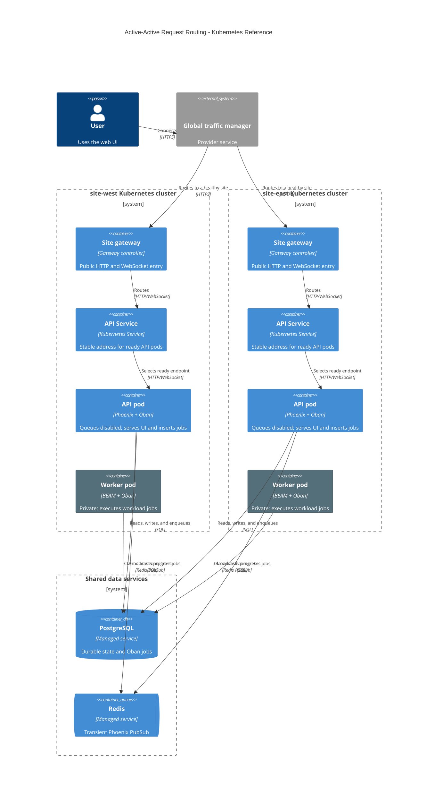
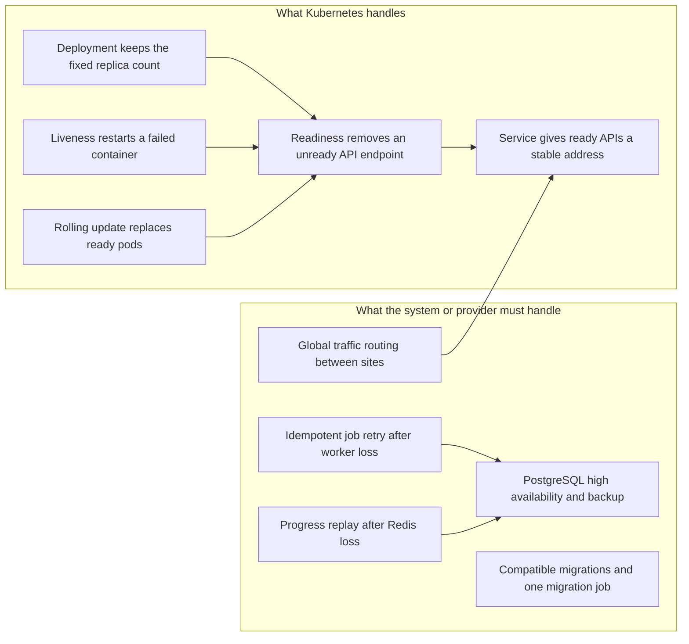

# Load Balancing and Proxy Primer

Status: records working design decisions. The local implementation remains
Terraform-managed Docker. Kubernetes content is a comparison only.

## Terms

A load balancer selects a backend for a connection. A reverse proxy accepts a
client request and forwards it to that backend. An edge proxy is a reverse
proxy at the public network boundary. One component can provide all three
functions.

A global traffic manager selects a site. It can use DNS, anycast, or a global
HTTP proxy. Kubernetes does not provide this cross-cluster function.

A site gateway accepts traffic for one Kubernetes cluster. It routes HTTP and
WebSocket connections to a Service. A Kubernetes Service gives pods a stable
internal address and selects ready pod endpoints. It is not a public gateway.

An internal load balancer can mean either a Kubernetes Service or a cloud
provider's private load balancer. State the meaning each time.

## Kubernetes Reference Model

This diagram explains the Kubernetes terms. It does not propose Kubernetes as
the deployment target for this project. The Docker model follows this section.

Workers receive no user traffic. Oban and PostgreSQL distribute work between
workers. The global traffic manager does not select a worker.

With one API pod in each site, the site gateway and Service provide a stable
routing contract. They do not add same-site redundancy. A site loss leaves one
API pod and one worker pod in service.

## Local Model

The Docker simulator uses one HAProxy edge container. It publishes the browser
port and joins both site networks. It checks each API container's `/readyz`
endpoint and forwards Phoenix, Vite assets, and HMR WebSockets to ready API
containers. Workers, PostgreSQL, Redis, and analysis services publish no
browser port.

HAProxy keeps independent Phoenix and Vite backend pools. A failed Vite watcher
moves only asset and HMR traffic to the other site. It does not make the Phoenix
API unready. Vite servers use a shared dependency cache and HMR token because
the edge does not use affinity.

This proxy models global traffic routing only. It cannot model a highly
available provider load balancer because all local containers share one host.
Do not add a proxy pair for this simulator. It adds containers but does not add
a failure domain.

Use `/healthz` for process liveness. Use `/readyz` for API routing readiness.
The current readiness endpoint checks PostgreSQL only. The UI stays ready during
a Redis or analysis outage. The UI shows an error for an analysis request. It
does not reconcile missed progress events.

The local edge uses HTTP on loopback. A production provider gateway terminates
TLS. This local model does not add certificate handling.

## Kubernetes Boundary

Kubernetes can restore a declared container count when the cluster has
capacity. It cannot restore a lost site. It cannot make an interrupted job
safe to run again. It cannot provide a shared database or cross-site traffic
routing by itself.

With fixed counts, do not add an autoscaler. Use a Deployment for each API and
worker role. Use readiness and liveness probes. Add topology placement rules
only when each site has more than one physical failure domain.

## Session and WebSocket Behavior

The edge proxy chooses an API node when a client connects. A WebSocket stays on
that API node until the connection closes. A reconnect can use the other site.

The API nodes must share signing secrets. A reconnected LiveView resubscribes
to progress. Redis PubSub does not replay messages. The design adds no automatic
reconciliation for a missed progress event.

This project stores the LiveView session in a signed cookie and loads dashboard
data on mount. The design makes no claim that an API failover preserves every
progress update.

## Tool Choices

| Tool | Use | Decision guidance |
|---|---|---|
| HAProxy | One fixed local edge proxy with active health checks | Selected. Terraform already knows the fixed API set, so static generated backends are sufficient. |
| Traefik | Dynamic Docker or Kubernetes route discovery | Use only if dynamic discovery is a real requirement. It adds a control plane that fixed replicas do not need. |
| Gateway API controller | Kubernetes reference only | Use only if a future deployment uses Kubernetes. It is not part of this Docker design. |
| k6 | Load and resilience traffic | Use during controlled API or site failure tests. It does not inject the failure itself. |
| curl | Readiness and routing checks | Use for a small manual check during local experiments. |

HAProxy is selected for the local edge. It supports HTTP, WebSocket, and
health checks. Its fixed backend configuration matches the fixed-replica
assumption. A production provider may use a different managed component.

## Working Decisions

| Area | Decision | Limit |
|---|---|---|
| API and workers | Replica `0` in each site is the API node. Every additional replica is a worker. Both sites are active. | Each site needs at least two replicas. It has one API node. |
| Bootstrap | `primary_site` places the one-shot local setup container only. | It has no runtime or failover meaning. |
| Public traffic | One loopback HTTP HAProxy container routes only to ready API nodes. | It is a local single point of failure. |
| Development assets | HAProxy routes Vite assets and HMR WebSockets through an independent backend pool. | A Vite failure moves only asset and HMR traffic to the other site. |
| Worker access | Workers have no host port and no HAProxy backend. | Containers on the trusted site bridge can still address them. |
| Metrics access | Remove the direct app metrics host port. Collectors scrape it internally. | Prometheus and Grafana remain operator entry points. |
| Debugger access | Keep the reserved debugger host port. | No current process listens on it. It stays outside HAProxy. |
| Analysis | Each API calls its local analysis service. | A local analysis failure fails that request. |
| PostgreSQL | Keep one shared local instance. | PostgreSQL loss stops the complete system. |
| Redis progress | Keep API nodes ready during Redis loss. Do not reconcile missed progress. | Progress is at-most-once. |
| Oban metrics | Every API node emits global queue depth. Grafana uses `max`. | Two small aggregate database queries run each interval. |
| Worker retry | Defer the final policy. | The current plan does not guarantee another worker or site executes a retry. |
| Proxy retry | HAProxy never retries a failed backend request. | The browser receives the error. This prevents a proxy retry from duplicating a write. |
| Planned API stop | Remove new traffic, then close LiveView connections. | Clients reconnect through HAProxy. |
| Site-loss exercise | Stop the affected site's API, worker, analysis, and collector. | Shared PostgreSQL, Redis, HAProxy, and observability continue. |

## Selected Failure Exercises

Red is a failure injection. Green is the surviving public path. Amber is a
degraded or unresolved behavior. The exercises use Docker containers and
networks. They do not use Kubernetes.

```mermaid
C4Container
  title Failure Exercises - Planned Active-Active Docker Model

  Person(user, "User", "Uses the loopback browser endpoint")
  Container(edge, "HAProxy edge", "Docker", "Only published browser port; checks API readiness")
  System_Ext(apiFailure, "API failure", "Failure injection", "Stops one API container")
  System_Ext(workerFailure, "Worker failure", "Failure injection", "Stops one worker container")
  System_Ext(siteFailure, "Site-west failure", "Failure injection", "Stops all site-west application containers")
  System_Ext(analysisFailure, "Analysis failure", "Failure injection", "Stops one local analysis container")

  Boundary(west, "site-west") {
    Container(westApi, "API", "Phoenix + Vite + Oban", "Queues disabled; local analysis client")
    Container(westWorker, "Worker", "BEAM + Oban", "Private; claims global jobs")
    Container(westAnalysis, "Analysis", "Python HTTP", "Serves site-west API only")
    Container(westCollector, "Collector", "OpenTelemetry", "Exports site-west telemetry")
  }
  Boundary(east, "site-east") {
    Container(eastApi, "API", "Phoenix + Vite + Oban", "Queues disabled; local analysis client")
    Container(eastWorker, "Worker", "BEAM + Oban", "Private; claims global jobs")
    Container(eastAnalysis, "Analysis", "Python HTTP", "Serves site-east API only")
    Container(eastCollector, "Collector", "OpenTelemetry", "Exports site-east telemetry")
  }
  Boundary(shared, "Shared services") {
    ContainerDb(postgres, "PostgreSQL", "PostgreSQL", "Durable state and Oban jobs")
  }

  Rel_D(user, edge, "Uses", "HTTP")
  Rel_D(edge, westApi, "Routes while ready", "HTTP/WebSocket")
  Rel_D(edge, eastApi, "Routes while ready", "HTTP/WebSocket")
  Rel_D(apiFailure, westApi, "1. Stops API", "container failure")
  Rel_R(apiFailure, edge, "2. Fails readiness; new traffic uses east", "HTTP health check")
  Rel_D(workerFailure, westWorker, "3. Interrupts work; retry policy is deferred", "container failure")
  Rel_D(siteFailure, westApi, "4. Stops API", "site failure")
  Rel_D(siteFailure, westWorker, "5. Stops worker", "site failure")
  Rel_D(siteFailure, westAnalysis, "6. Stops analysis", "site failure")
  Rel_D(siteFailure, westCollector, "7. Stops collector", "site failure")
  Rel_R(siteFailure, edge, "8. Routes new traffic to east", "HTTP health check")
  Rel_D(analysisFailure, westAnalysis, "9. Fails the local analysis request", "container failure")
  Rel_R(analysisFailure, westApi, "10. API stays ready; request returns an error", "HTTP")
  Rel_D(westApi, postgres, "Reads, writes, and enqueues", "SQL")
  Rel_D(eastApi, postgres, "Reads, writes, and enqueues", "SQL")
  Rel_D(westWorker, postgres, "Claims and completes jobs", "SQL")
  Rel_D(eastWorker, postgres, "Claims and completes jobs", "SQL")

  UpdateElementStyle(apiFailure, $bgColor="#C62828", $fontColor="#FFFFFF", $borderColor="#8E0000")
  UpdateElementStyle(workerFailure, $bgColor="#C62828", $fontColor="#FFFFFF", $borderColor="#8E0000")
  UpdateElementStyle(siteFailure, $bgColor="#C62828", $fontColor="#FFFFFF", $borderColor="#8E0000")
  UpdateElementStyle(analysisFailure, $bgColor="#C62828", $fontColor="#FFFFFF", $borderColor="#8E0000")
  UpdateElementStyle(edge, $bgColor="#2E7D32", $fontColor="#FFFFFF", $borderColor="#1B5E20")
  UpdateElementStyle(eastApi, $bgColor="#2E7D32", $fontColor="#FFFFFF", $borderColor="#1B5E20")
  UpdateElementStyle(eastWorker, $bgColor="#F9A825", $fontColor="#000000", $borderColor="#F57F17")
  UpdateElementStyle(westWorker, $bgColor="#F9A825", $fontColor="#000000", $borderColor="#F57F17")
  UpdateRelStyle(apiFailure, westApi, $lineColor="#C62828", $textColor="#C62828", $offsetY="-25")
  UpdateRelStyle(apiFailure, edge, $lineColor="#2E7D32", $textColor="#2E7D32", $offsetY="25")
  UpdateRelStyle(workerFailure, westWorker, $lineColor="#C62828", $textColor="#C62828", $offsetY="-25")
  UpdateRelStyle(siteFailure, edge, $lineColor="#2E7D32", $textColor="#2E7D32", $offsetY="25")
  UpdateRelStyle(analysisFailure, westAnalysis, $lineColor="#C62828", $textColor="#C62828", $offsetY="-25")
  UpdateRelStyle(analysisFailure, westApi, $lineColor="#F57F17", $textColor="#F57F17", $offsetY="25")
```

### Manual Exercise Contract

The operator records the target container, start time, and observed result. The
operator stops the selected container, checks the result through HAProxy, then
restarts the container. Container names come from the current Terraform outputs
or Docker state. Do not add a fault-injection framework.

| Exercise | Target | Expected result |
|---|---|---|
| API loss | One site API container | HAProxy removes the unready backend. New browser connections use the other site's API. Existing LiveViews close and reconnect. |
| Worker loss | One worker container while it executes work | The job is interrupted. The final retry outcome is deliberately not specified yet. |
| Site loss | One site's API, workers, analysis, and collector | New browser connections use the surviving site's API. The surviving workers continue to claim newly available jobs. |
| Analysis loss | One site's analysis container | A request through that site's API fails. The API remains ready. |

The exercises do not claim recovery from a PostgreSQL, Redis, or HAProxy outage.
Those shared local dependencies remain documented failure limits.

## References

- [Kubernetes Service](https://kubernetes.io/docs/concepts/services-networking/service/)
- [Kubernetes Gateway API](https://kubernetes.io/docs/concepts/services-networking/gateway/)
- [Kubernetes liveness, readiness, and startup probes](https://kubernetes.io/docs/concepts/configuration/liveness-readiness-startup-probes/)
- [HAProxy protocol support, including WebSocket](https://www.haproxy.com/documentation/haproxy-configuration-tutorials/protocol-support/)
- [HAProxy health checks](https://www.haproxy.com/documentation/haproxy-configuration-tutorials/reliability/health-checks/)
- [Traefik Docker provider](https://doc.traefik.io/traefik/providers/docker/)
- [Grafana k6](https://grafana.com/docs/k6/latest/)
