# MapReduce computation design

Status: proposed. This document defines the intended API and delivery phases.
It is not an implementation record.

## Purpose

Provide one direct API for simulation and optimization computations. Select the
execution strategy at application startup. The same operation code must run
locally or through Oban without knowing about nodes, queues, or sites.

PostgreSQL is the shared rendezvous point. Mappers persist domain results and
return small references. Reducers read those references and complete the domain
operation.

## Scope

The target design covers:

- a `MapReduce` public API;
- registered and versioned operation modules;
- Local and Oban executors;
- simulation trial partitions;
- uniform optimization across all registered strategies;
- equal partition allocation across healthy sites;
- retries, cancellation, failure recovery, and observability.

The first working slice is smaller. It contains the interface, Local execution,
simulation, telemetry, and essential tests. See [Phased todo](#phased-todo).

The first implementation does not include:

- simulated annealing step distribution and nested score distribution;
- nested MapReduce runs;
- direct Erlang-distribution, RabbitMQ, or NATS executors;
- node-local graph caching;
- statistical analysis distribution;
- a scaling claim or performance acceptance target.

## Design summary

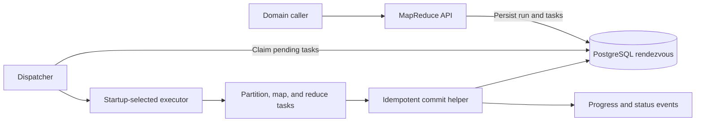

The public API exposes the computation pattern. The executor is an internal
strategy. The executor transports tasks and selects execution sites. It does
not define simulation or optimization behavior.

## Public API

Operation modules follow the changeset pipeline used by Oban workers:

```elixir
DistributedRun.new(%{experiment_id: experiment.id})
|> MapReduce.start()
# => {:ok, %MapReduce.Run{}}
# => {:error, %Ecto.Changeset{}}
```

The blocking form starts the same durable run and waits for its result:

```elixir
DistributedRun.new(%{experiment_id: experiment.id})
|> MapReduce.run(timeout: 5_000)
# => {:ok, %{"experiment_id" => id}}
# => {:error, :timeout, %MapReduce.Run{}}
# => {:error, reason}
```

The initial public functions are:

```elixir
MapReduce.start(operation_changeset)
MapReduce.run(operation_changeset, timeout: 5_000)
MapReduce.await(run, timeout: 5_000)
MapReduce.status(run)
MapReduce.subscribe(run)
MapReduce.cancel(run)
```

`run/2` is `start/1` followed by `await/2`. A caller timeout does not cancel the
durable computation. The caller receives the run handle and can await it again.
A caller crash or disconnect also does not cancel the run.

The generated `new/1` function returns an operation changeset. `run/2` can
therefore also return `{:error, changeset}` before it creates a run. The timeout
result has a separate three-element form because it must return the durable run
handle.

`await/2` reads durable status from PostgreSQL. PubSub wakes the waiter early.
A missed PubSub message cannot leave a waiter blocked indefinitely.

Final results are JSON-safe references. Domain contexts load the associated
experiment or optimization record.

## Operation contract

Use a small macro, similar to `use Oban.Worker`, to declare operation metadata
and policy defaults:

```elixir
defmodule NetworkDefense.Simulation.DistributedRun do
  use NetworkDefense.Compute.MapReduce.Operation,
    name: "simulation",
    version: 1

  embedded_schema do
    field :experiment_id, :binary_id
  end

  @impl true
  def changeset(operation, attrs), do: operation_changeset(operation, attrs)

  @impl true
  def partition(operation), do: simulation_partitions(operation)

  @impl true
  def map(operation, partition), do: run_partition(operation, partition)

  @impl true
  def reduce(operation, reduction), do: complete_simulation(operation, reduction)

  @impl true
  def max_rounds(_operation), do: 1

  @impl true
  def policy(_operation), do: simulation_policy()
end
```

The conceptual behavior is:

```elixir
defmodule NetworkDefense.Compute.MapReduce.Operation do
  @callback changeset(struct(), map()) :: Ecto.Changeset.t()

  @callback partition(struct()) ::
              {:ok, [map()]}
              | {:error, :retryable | :permanent, term()}

  @callback map(struct(), MapReduce.Partition.t()) ::
              MapReduce.commit_result()
              | {:error, :retryable | :permanent, term()}

  @callback reduce(struct(), MapReduce.Reduction.t()) ::
              MapReduce.commit_result()
              | {:error, :retryable | :permanent, term()}

  @callback max_rounds(struct()) :: pos_integer()
  @callback policy(struct()) :: MapReduce.Policy.t()
end
```

`partition/1` is read-only and deterministic. The framework persists all
returned partitions atomically. It assigns stable indexes in returned-list
order.

`map/2` receives the validated operation struct and one framework partition.
The partition contains its stable identity, index, and operation-defined input.

`reduce/2` receives ordered result references. Result order follows partition
index, not completion time. This preserves fixed-seed behavior.

A reducer returns one of these outcomes through the commit helper:

```elixir
{:continue, next_operation}
{:done, result_reference}
```

`{:continue, next_operation}` starts another bounded round. `max_rounds/1`
prevents an invalid reducer from continuing forever.

An explicit registry resolves persisted names. Do not persist Elixir module
names or convert database strings to atoms.

```elixir
%{
  "simulation" => NetworkDefense.Simulation.DistributedRun,
  "optimization" => NetworkDefense.Optimization.DistributedRun
}
```

The run stores the operation version. A worker that does not support that
version fails the run permanently. One run must not mix operation versions.

## Commit contract

Mapper and reducer computations run outside database transactions. The
operation then calls the framework commit helper:

```elixir
MapReduce.commit(partition, result_reference, fn ->
  persist_domain_result()
end)
```

The helper performs one transaction:

1. Lock the task.
2. Check the run status and task generation.
3. Execute the domain write.
4. Save the result reference.
5. Mark the task complete.
6. Create the next reducer or round task when necessary.

Reducers use a separate named helper because their callback selects the next
workflow state rather than supplying one map result reference:

```elixir
MapReduce.commit_reduction(reduction, fn ->
  {:continue, next_operation}
  # or {:done, result_reference}
end)
```

Duplicate delivery is expected. Execution is at least once, but a task can
produce a domain effect only once. A stale generation cannot commit.

Reducer commits use the same transactional checks. This prevents a duplicate
reducer from applying an optimization action twice or completing a run twice.

Existing experiment and optimization statuses remain. Operation lifecycle
hooks synchronize them with MapReduce completion, failure, and cancellation.

## Execution strategies

Select one executor at startup. Production startup fails when the selection is
missing or unknown. Tests use Local by default.

```elixir
config :network_defense,
  map_reduce_executor: NetworkDefense.Compute.Executors.Oban
```

The internal behavior stays small:

```elixir
defmodule NetworkDefense.Compute.Executor do
  @callback dispatch(NetworkDefense.Compute.Task.t()) ::
              :ok | {:error, term()}

  @callback cancel(MapReduce.Run.t()) :: :ok
end
```

The MapReduce layer enforces operation retry policy. Executors must not add a
second independent retry policy.

### Local

Local runs tasks under a supervised, bounded local pool. Pending tasks remain
in PostgreSQL until pool capacity is available. In a multi-node deployment,
Local keeps a run on its origin node.

```elixir
def dispatch(task) do
  NetworkDefense.Compute.LocalPool.enqueue(task)
end
```

### Oban

Oban distributes partition, map, and reducer tasks across nodes and sites. Each
site has one compute queue. API and worker nodes consume their site's queue at
equal concurrency.

```elixir
def dispatch(task) do
  case task
       |> MapReduceWorker.new(queue: site_queue(task.site), max_attempts: 1)
       |> Oban.insert() do
    {:ok, _job} -> :ok
    {:error, reason} -> {:error, reason}
  end
end
```

Oban receives one delivery attempt per MapReduce generation. MapReduce decides
whether to retry and which site receives the new generation.

Allowing API nodes to consume compute queues intentionally changes the current
role policy. The runtime must keep existing simulation, optimization, and
evaluation queues off API nodes while it enables only their site-local compute
queue. Update the stable architecture document when this phase is implemented.

### RabbitMQ example

RabbitMQ is a later executor. Use a durable queue per site and competing
consumers within the site. Plain fan-out pubsub does not provide work-queue
semantics.

```elixir
def dispatch(task) do
  RabbitPublisher.publish(
    "map_reduce",
    task.site,
    Jason.encode!(task.message),
    persistent: true
  )
end
```

Broadway can provide the consumer, acknowledgements, bounded demand, failure
handling, and telemetry. NATS follows the same shape with one JetStream subject
per site and a queue-consumer group in each site.

### Direct Erlang distribution

A later Erlang executor can start remote supervised tasks with explicit module,
function, and argument calls. It must not send anonymous functions. The current
site-local BEAM meshes limit this executor to one site unless deployment
security and topology change.

## Site allocation

Terraform passes the local site ID and expected site list through environment
variables. The application must not infer site identity from node names.

Each executor process records a heartbeat in PostgreSQL every 10 seconds. A
site is unavailable after 30 seconds without a ready consumer. These values are
constants in the first Oban phase.

For each map round, the executor allocates partitions equally across healthy
sites in sorted site-ID order. The first sorted site receives any remainder.
This rule is deterministic and simple.

All API and worker nodes are eligible at equal concurrency. Nodes inside one
site compete for that site's queue.

When a site fails, MapReduce creates a new task generation on another healthy
site. One retry counter initially covers execution and placement failures. Its
effective limit is at least the number of sites that were healthy when the run
started.

When a site returns, it receives new work only. The executor does not move work
that it already reassigned.

The reducer uses the executor's normal simple site selection. It has no origin
or data affinity because all durable state is in shared PostgreSQL.

## Simulation operation

Simulation partitions use stable, contiguous trial-index ranges. Partition
size does not depend on the selected executor. Start with the current simulation
batch boundary.

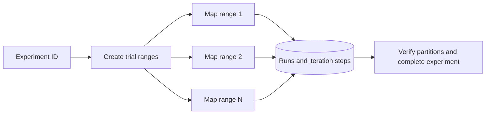

Brief operation pseudocode:

```elixir
defmodule SimulationMapReduce do
  use MapReduce.Operation, name: "simulation", version: 1

  def partition(%{experiment_id: id}) do
    experiment = Experiments.get!(id)
    {:ok, contiguous_trial_ranges(experiment)}
  end

  def map(operation, partition) do
    experiment = Experiments.get!(operation.experiment_id)
    graph = Graphs.load!(experiment.graph_revision_id)
    context = simulation_context(graph, experiment)

    runs =
      Simulator.run_batch(
        experiment,
        graph,
        context.initial_attacker_state,
        partition.input,
        rules: context.rules,
        max_attempts: experiment.max_attempts
      )

    MapReduce.commit(partition, %{"run_count" => length(runs)}, fn ->
      Experiments.persist_partition(experiment, partition.id, runs)
    end)
  end

  def reduce(operation, reduction) do
    MapReduce.commit_reduction(reduction, fn ->
      with {:ok, _experiment} <- Experiments.complete(operation.experiment_id) do
        {:done, %{"experiment_id" => operation.experiment_id}}
      end
    end)
  end
end
```

The real mapper supplies the existing attacker state, rule set, attempt limit,
and seed inputs. Trial seeds continue to derive from the master seed and global
trial index. Scheduling must not change trial output.

The current `Experiments.append_batch/3` assumes one sequential writer. Replace
that assumption with partition-aware idempotent persistence. Keep the existing
run and iteration tables as domain storage. Serialize only the short commit that
updates shared experiment progress; simulation computation remains parallel.

## Uniform optimization operation

One registered operation serves every strategy. It loads the persisted run,
reconstructs the current strategy, and emits one of two internal work plans:

- `serial_rank`: one map task calls the existing `Strategy.rank/4` and returns
  compact action references;
- `candidate_scores`: the simulation-informed strategy emits a baseline and one
  candidate-score map task.

The operation input persists everything needed to reproduce
`Optimizer.apply/4`: the `optimization_run_id`, the validated request and
strategy configuration, and the optimizer-level
`require_pre_attack_feasibility` option. Direct optimization uses the option's
current default `true`; the evaluation runner supplies its model-variant value.
This optimizer-level feasibility option is separate from the feasibility
setting carried inside the two simulation-backed strategies
(`simulation_informed` and `simulated_annealing`). The reducer must preserve the
optimizer-level feasibility check for every strategy and every round.

Uniformity means one public lifecycle, one executor, one durable status model,
and one operation. It does not mean identical partition counts or that every
strategy gains parallel speedup.

| Strategy              | Existing behavior                                                             | MapReduce work plan                                  |
| --------------------- | ----------------------------------------------------------------------------- | ---------------------------------------------------- |
| Null                  | Returns no actions; stepwise                                                  | One serial rank map, then finish                     |
| Random                | Returns one seeded random action; stepwise                                    | One serial rank map per round                        |
| CVSS                  | Sorts vulnerabilities by CVSS and edge ID; stepwise                           | One serial rank map per round                        |
| Topology segmentation | Ranks policies by reachable-host reduction and edge ID; stepwise              | One serial rank map per round initially              |
| Simulation-informed   | Baseline plus independent candidate simulation scores; stepwise               | Baseline and one candidate per map                   |
| Simulated annealing   | Serial stochastic search threading random state; returns one plan; plan-based | One serial rank map for the search, then one reducer |

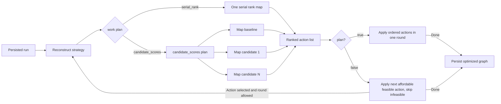

Brief operation pseudocode:

```elixir
defmodule OptimizationDistributedRun do
  use MapReduce.Operation, name: "optimization", version: 1

  def partition(operation) do
    strategy = reconstruct_strategy(operation)
    case strategy_work_plan(strategy) do
      :serial_rank -> {:ok, [%{"kind" => "serial_rank"}]}
      :candidate_scores -> {:ok, candidate_score_requests(operation)}
    end
  end

  def map(operation, partition) do
    strategy = reconstruct_strategy(operation)
    %{graph: graph, remaining_budget: remaining_budget} = round_state(operation)

    case partition.input do
      %{"kind" => "serial_rank"} ->
        actions = Strategy.rank(strategy, action_types(), graph, remaining_budget)
        MapReduce.commit(partition, compact_actions_reference(actions), fn -> :ok end)
      %{"kind" => kind} when kind in ["baseline", "candidate_score"] ->
        score = score_like_current_strategy(strategy, graph, partition.input)
        MapReduce.commit(partition, score_reference(partition.input, score), fn -> :ok end)
    end
  end

  def reduce(operation, reduction) do
    strategy = reconstruct_strategy(operation)
    actions = ranked_actions_like_current_strategy(strategy, reduction.results)

    MapReduce.commit_reduction(reduction, fn ->
      if Strategy.plan?(strategy) do
        apply_plan_and_finish(operation, actions)
      else
        case apply_first_affordable_feasible(operation, actions) do
          {:applied, %{remaining_budget: 0} = final_operation} ->
            finish_optimization(final_operation)

          {:applied, next_operation} ->
            {:continue, next_operation}

          :none ->
            finish_optimization(operation)
        end
      end
    end)
  end

  def max_rounds(operation), do: requested_budget(operation)
end
```

The common reducer converts map results into the same ranked action list the
current strategy produces. For a plan-based strategy, it applies actions in
order, skips infeasible actions, and stops at the first unaffordable action. For
a stepwise strategy, it applies only the first affordable feasible action. It
then reranks the changed graph in a new round when the budget permits.

A stepwise reducer finishes in the same round that uses the remaining budget.
It continues only after it applies an action and the next round can still apply
an action.

`apply_plan_and_finish/2` and `finish_optimization/1` persist the optimized graph
and run. Both return `{:done, %{"optimization_run_id" => run_id}}`.

The optimization round bound uses the current requested budget as
`max_rounds`. Current actions have unit cost and a stepwise strategy can select
at most one action per round, so the budget is an upper bound on rounds. A
plan-based operation completes in round one. This bound avoids
strategy-specific framework behavior and prevents a reducer from continuing
without limit.

Preserve current deterministic behavior:

- random uses its existing seed behavior;
- CVSS and topology keep their current tie-break ordering;
- greedy keeps `{score, target_id}` ordering and sequential inner simulation
  trials so floating-point accumulation order does not change;
- annealing runs its complete current serial loop in one map task so the
  threaded random state and acceptance sequence do not change.

The `candidate_scores` work plan preserves the `simulation_informed` strategy
exactly. It scores the baseline graph with `SimulationObjective.expected` and
`ranking_key`. It then applies a candidate graph feasibility check using the
strategy's `require_pre_attack_feasibility` setting, runs sequential inner
simulations for each candidate so floating-point accumulation order is stable,
filters with the strict candidate score `< baseline` comparison, and orders
survivors by `{score, target_id}`. The mapper calculates each score. The reducer
applies the filter and ordering to produce the current strategy's ranked list.

Do not add nested MapReduce. Do not split annealing decisions across tasks. A
later durable annealing step machine is only for shorter retry units or
distributed score simulations if measurements justify the complexity.

The reducer persists enough operation state to rebuild the current graph in the
next round. Do not add a graph cache.

The evaluation runner uses blocking MapReduce calls for simulation and
optimization. Its outer plan and experiment order remains sequential. It passes
an explicit long or infinite wait timeout rather than the public five-second
default.

## Happy-path sequence

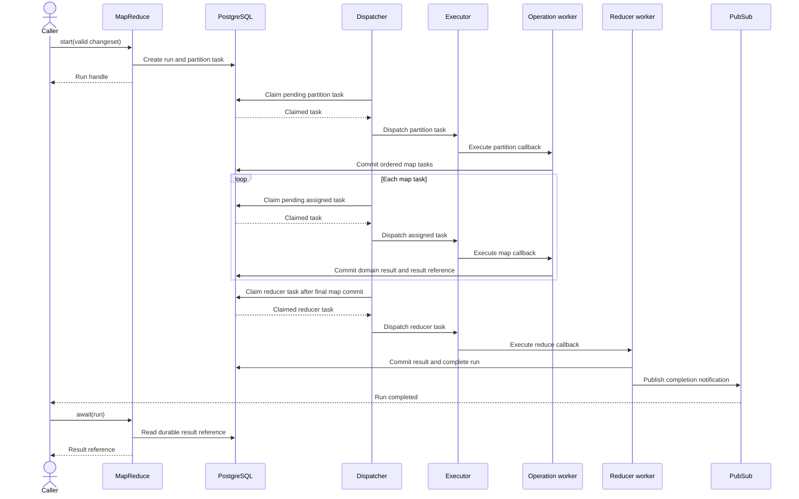

## Repeated optimization sequence

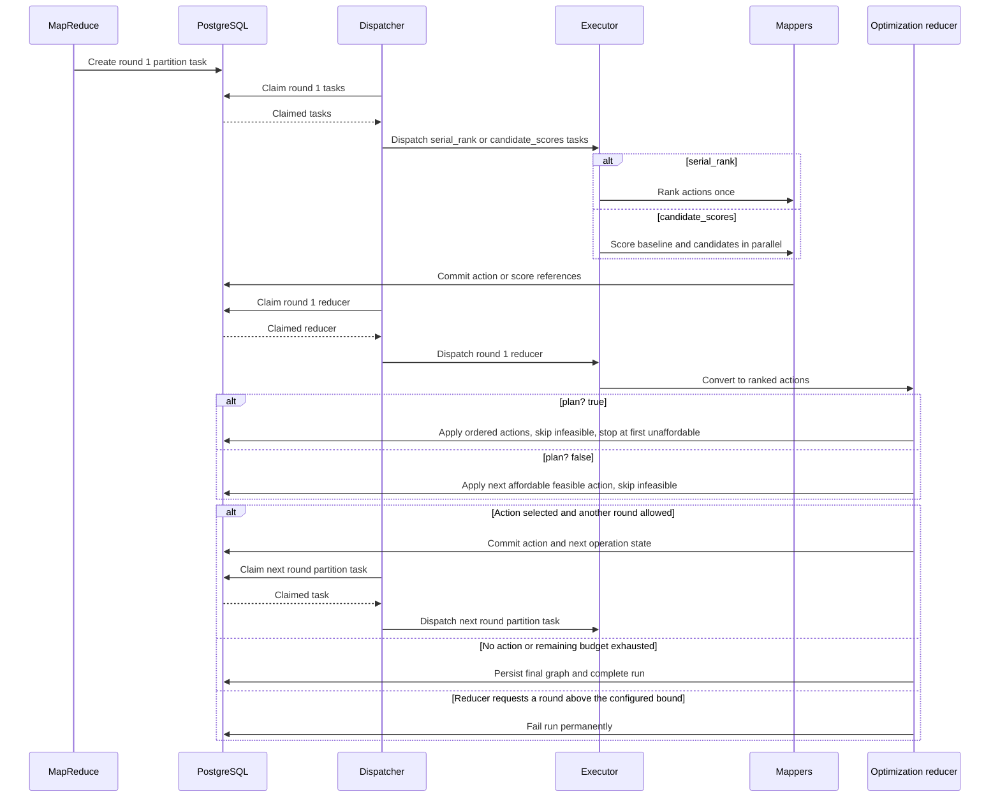

## Failure and cancellation sequences

### Retry and site failure

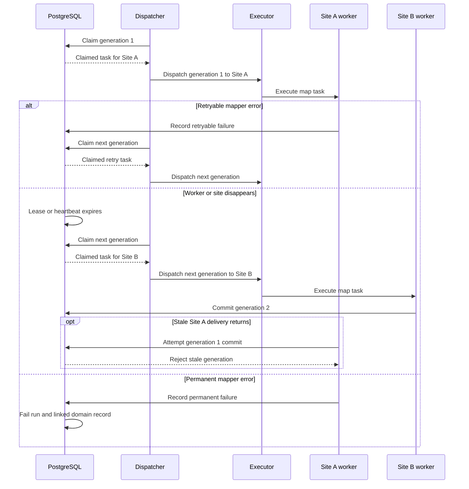

### Exhausted retries

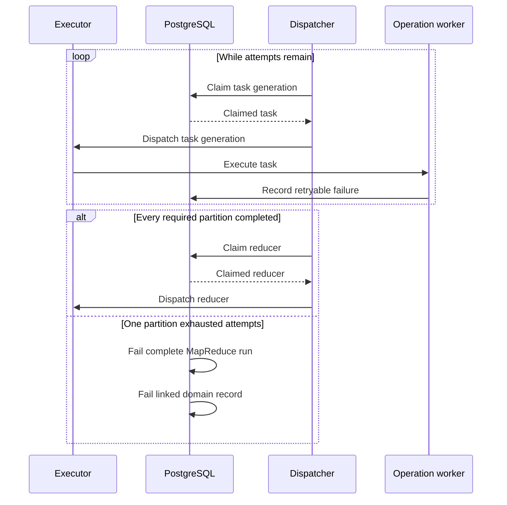

The reducer never receives partial data after an exhausted partition.

### Caller timeout and cancellation

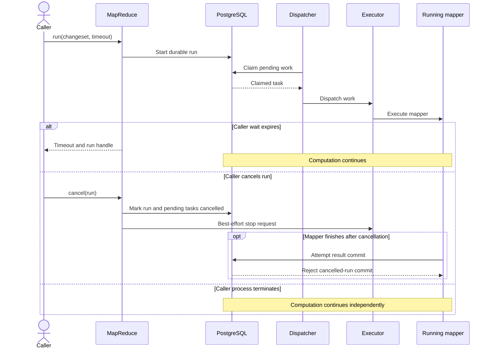

## Status state machines

### MapReduce run

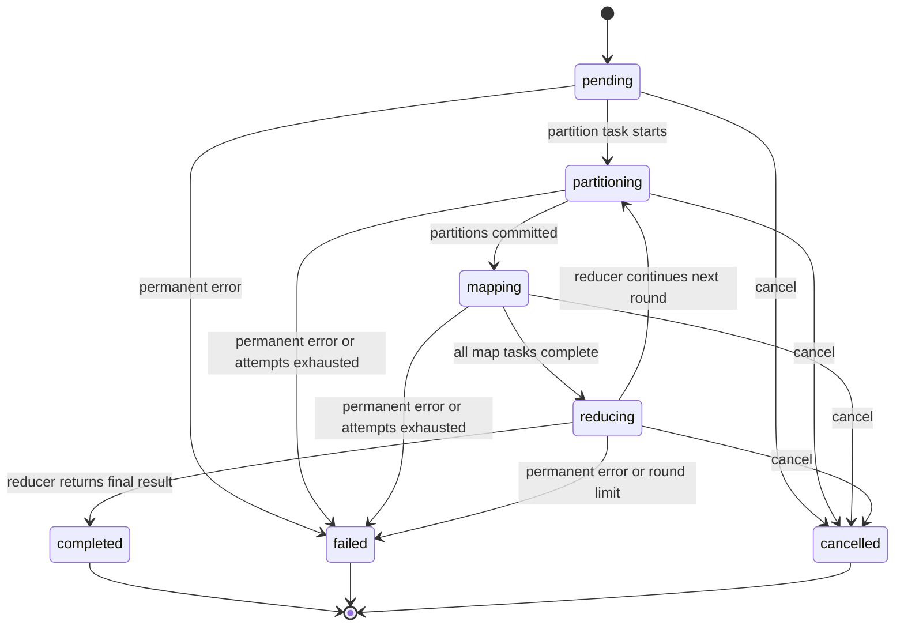

### Executor task

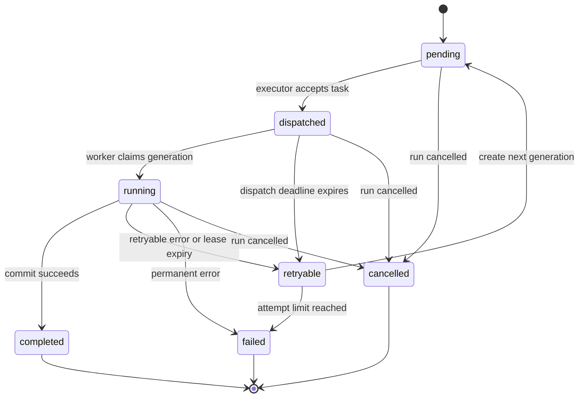

### Site health

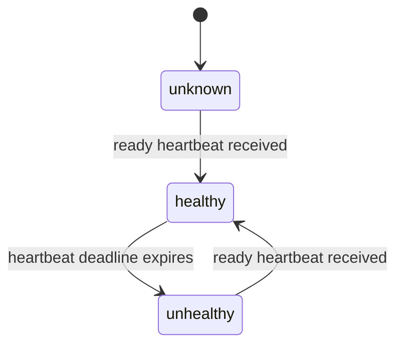

Recovered sites receive only newly created tasks. Existing task generations do
not move back.

## Failure semantics

| Failure                        | Required behavior                                                                 |
| ------------------------------ | --------------------------------------------------------------------------------- |
| Invalid operation input        | Return the changeset error. Create no run.                                        |
| Retryable operation error      | Create a new task generation after policy backoff.                                |
| Permanent operation error      | Fail the run and linked domain record.                                            |
| Duplicate delivery             | Allow only one generation commit. Treat later delivery as success with no effect. |
| Worker loss during compute     | Expire the lease and dispatch a new generation.                                   |
| Whole-site loss                | Mark the site unhealthy and reassign incomplete tasks to healthy sites.           |
| Site recovery                  | Use the site for new tasks only.                                                  |
| Reducer loss                   | Retry the reducer through the selected executor.                                  |
| Caller timeout or loss         | Continue the durable run.                                                         |
| Cancellation                   | Mark the run cancelled immediately and reject later commits.                      |
| PostgreSQL loss                | Stop durable coordination. Existing readiness limits apply.                       |
| PubSub loss                    | Keep computing. Await and status use PostgreSQL as truth.                         |
| Operation version mismatch     | Fail permanently. Do not mix versions.                                            |
| Executor changes after restart | Resume pending and expired work with the currently configured executor.           |

All task kinds share these rules. A long serial rank task has the same lease,
retry, stale-generation, and cancellation behavior as a candidate score task or
a reducer task.

## Persistence model

Use names that match the public model rather than exposing broker terms:

| Record         | Purpose                                                                                                        |
| -------------- | -------------------------------------------------------------------------------------------------------------- |
| MapReduce run  | Operation name and version, validated input, current round, status, result reference, failure, and origin node |
| MapReduce task | Stage, round, partition index, input, result reference, site, generation, attempt, lease, and timing           |
| Compute node   | Node, site, role, executor readiness, and last heartbeat                                                       |

Pending task rows are also the dispatch outbox. If dispatch succeeds but the
status update fails, the dispatcher can send a duplicate. Generation checks
keep this safe without a separate outbox table.

Retain per-task execution metadata for failure analysis and site-allocation
evidence. Add configurable pruning after the core workflow is stable.

## Progress, logs, traces, and metrics

MapReduce emits generic progress. Operations attach domain detail such as trial
counts or defense-selection text.

Generic events:

```text
map_reduce.started
map_reduce.partition.completed
map_reduce.partition.reassigned
map_reduce.round.completed
map_reduce.completed
map_reduce.failed
map_reduce.cancelled
```

Create one OpenTelemetry span for each partition task and reducer task. Do not
create one span per simulation trial. Carry the run correlation ID, operation,
version, round, stage, attempt, executor, site, and role. Optimization spans
also carry the bounded strategy identifier and the `serial_rank` or
`candidate_scores` work-plan type.

Logs can contain run and task IDs. Metrics must not use IDs as labels. No
strategy-specific infrastructure metrics exist; strategy and work-plan type
remain bounded log and span labels only.

Initial metrics:

| Metric                    | Bounded labels                                  |
| ------------------------- | ----------------------------------------------- |
| Work task count           | operation, executor, stage, outcome, site, role |
| Work duration             | operation, executor, stage, site                |
| Queue delay               | operation, executor, stage, site                |
| Retry count               | operation, executor, reason, site               |
| Pending task gauge        | operation, executor, stage, site                |
| Active compute node gauge | executor, site, role                            |
| Run count                 | operation, executor, outcome                    |

The first working slice needs task counts, task duration, run outcome, and
structured lifecycle logs. Add queue delay, retries, site health, and dashboards
with Oban multisite execution.

## Essential tests

The minimum test set is:

1. A valid operation changeset starts a run; an invalid changeset does not.
2. Local simulation partitions complete and produce the same fixed-seed runs as
   the current implementation.
3. The reducer receives references in partition order despite reverse map
   completion order.
4. Duplicate map delivery produces one domain effect.
5. A mapper failure marks the MapReduce run and experiment failed.
6. Telemetry reports map duration and terminal run outcome.

Every executor must later pass one shared conformance suite for dispatch,
duplicate delivery, retries, cancellation, reduction, and executor switching.

Oban multisite tests must also verify equal site assignment, API participation,
worker loss, whole-site loss, stale-generation rejection, and site recovery.

Essential optimization tests must compare every strategy with current fixed
behavior. First through Local, then through Oban. Cover null completion,
stepwise rounds, plan-based annealing, greedy result ordering, retries and
idempotency, and seeded equality. Also verify constrained and unconstrained
feasibility equivalence, plan budget halt and infeasible-action skip behavior,
and that the requested budget bounds the number of rounds.

## Phased todo

Keep each phase independently usable. Expand the implementation plan before
starting a phase after the minimum slice.

### Phase 1: Minimum Local simulation slice

- Define `MapReduce`, `MapReduce.Operation`, run handle, registry, and Local
  executor.
- Add only the run and task persistence required by Local execution.
- Implement simulation partition, map, commit, and reduce callbacks.
- Route direct simulation start and blocking simulation calls through
  MapReduce.
- Emit structured lifecycle logs, map duration, task count, and run outcome.
- Add the six essential tests above.
- Keep optimization and multisite execution unchanged.

Completion gate: Local simulation produces the same fixed-seed domain result as
the current path, survives duplicate delivery, and exposes useful telemetry.

### Phase 2: Oban executor happy path

- Add the Oban executor and one compute queue per configured site.
- Let API and worker nodes consume their site's queue at equal concurrency.
- Pass site identity from the deployment manifest.
- Allocate every map round equally across configured healthy sites.
- Remove the old coarse simulation Oban worker after the new path passes.
- Run the shared executor conformance suite for Local and Oban.

Completion gate: one simulation uses both sites and produces the same result as
Local.

### Phase 3: Multisite failure behavior

- Add compute-node heartbeats with the initial fixed timing.
- Add task generations, leases, common retry policy, site reassignment, and
  immediate logical cancellation.
- Synchronize MapReduce failures and cancellation with experiment status.
- Add retry, queue-delay, pending-task, and active-node telemetry.
- Exercise worker loss and whole-site loss in the Terraform local stack.

Completion gate: an interrupted task commits once on a surviving site, or the
whole run fails after its attempt limit. No partial result completes.

### Phase 4: Uniform optimization

- Add one registered `"optimization"` operation with the `serial_rank` and
  `candidate_scores` work plans.
- Implement the common reducer that preserves `plan?` versus stepwise rules.
- Persist enough operation state to rebuild each round without a graph cache.
- Preserve current fixed-seed actions, tie-break ordering, and seeded equality
  for all six strategies.
- Run the essential optimization equivalence tests through Local and Oban.
- Remove the old coarse optimization Oban worker only after every strategy
  passes the equivalence tests.
- Make evaluation use blocking MapReduce calls while keeping its outer lifecycle
  sequential.

Completion gate: Local and Oban produce the same result as the current
implementation for every strategy on fixed inputs and seeds.

### Phase 5: Operational completion

- Add execution-history pruning configuration.
- Add Grafana panels and alerts for queue delay, failures, stale tasks, and site
  capacity.
- Complete multi-site cancellation and executor-switch restart exercises.
- Update stable architecture and concept documentation after implementation.

## Later changes from simple-first decisions

| Initial decision                       | Change only when needed                                                                        |
| -------------------------------------- | ---------------------------------------------------------------------------------------------- |
| Fixed heartbeat and failure timing     | Move values to runtime environment when local and WAN deployments need different timing.       |
| One retry counter                      | Split computation retries from placement failovers when outages consume useful retry capacity. |
| First sorted site receives remainder   | Rotate the first site by run hash if allocation history shows persistent bias.                 |
| Equal site allocation                  | Add capacity weights only when sites have measured capacity differences.                       |
| Equal API and worker concurrency       | Lower API concurrency if compute work affects browser latency or readiness.                    |
| Reducer uses normal site selection     | Add affinity only if shared-database measurements show a locality benefit.                     |
| One map round balances independently   | Track whole-run allocation only if per-run fairness needs tighter control.                     |
| Load graph per partition               | Add a node-local immutable revision cache only after profiling shows material load cost.       |
| Candidate is the optimization map unit | Split candidate trials only when candidate-level parallelism is insufficient.                  |
| No nested MapReduce                    | Add parent-child lifecycle and reserved capacity before distributing nested work.              |
| Annealing stays serial in one map      | Model annealing as a persisted state machine before distributing step or score work.           |
| Local and Oban executors               | Add direct Erlang distribution, RabbitMQ, or NATS only with executor conformance tests.        |
| Retain execution metadata              | Add configurable pruning after retention needs are known.                                      |
| Functional acceptance only             | Use the separate thesis scaling study to measure speedup and overhead.                         |

## Existing integration points

- `src/lib/network_defense/simulation/simulator.ex` already exposes the map seam
  around trial execution.
- `src/lib/network_defense/simulations.ex` owns simulation batching, progress,
  and direct async dispatch.
- `src/lib/network_defense/simulation/experiments.ex` owns batch persistence and
  needs partition-aware idempotency.
- `src/lib/network_defense/optimizations.ex` registers all six strategies and
  exposes the persisted run the `"optimization"` operation loads.
- `src/lib/network_defense/optimization/optimizer.ex` owns the `plan?` versus
  stepwise rules the common reducer preserves.
- `src/lib/network_defense/optimization/simulation_informed_strategy.ex` owns
  independent candidate scoring.
- `src/lib/network_defense/optimization/simulation_objective.ex` defines the
  fixed-order score calculation that the distributed path preserves.
- `src/lib/network_defense/evaluation/evaluator.ex` remains the sequential outer
  coordinator and uses blocking MapReduce calls.
- `src/lib/network_defense/application.ex` starts the selected executor and its
  shared MapReduce processes.
- `src/config/runtime.exs` validates executor selection and configures site-local
  compute queues.
- `src/lib/network_defense_web/telemetry.ex` exposes the new bounded metrics.
- `infra/modules/local/app` must supply site identity and expected sites without
  provider-specific application logic.

## Post-completion checks

For each implementation phase:

1. Run focused tests for changed operation and executor modules.
2. Run `mix precommit` from `src`.
3. Inspect MapReduce run and task rows for terminal consistency.
4. Confirm logs include run, operation, stage, attempt, executor, and site.
5. Confirm Prometheus receives the expected bounded metrics.
6. Confirm Tempo links partition and reducer spans to the run.
7. For Oban phases, apply the local stack through
   `infra/environments/local/terraform.sh` and repeat the defined failure paths.

Do not claim scaling improvement from these checks. The thesis scaling study
owns that measurement.
