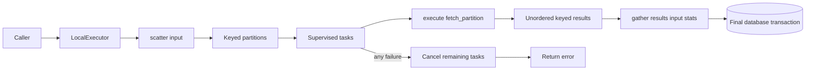

# Simple Scatter-Gather

## Design

### Purpose

Scatter-gather runs independent computation partitions and combines their results. Simulation and optimization can define different partition strategies through one operation behaviour.

V1 runs partitions on one Erlang node. It proves the operation contract before cross-cluster transport is added.

### V1 Scope

- Use ephemeral partition and result storage.
- Use `NetworkDefense.TaskSupervisor` for partition tasks.
- Limit active tasks. Use `System.schedulers_online/0` as the default.
- Do not set a partition timeout.
- Keep results unordered. Associate each result with its partition key.
- Report ephemeral progress after each successful partition.
- Cancel remaining tasks when one partition fails.
- Do not call `gather/3` after a partition failure.
- Keep all results in coordinator memory until all partitions succeed.
- Write computed domain data only during `gather/3`.
- Return `{:ok, value}` or `{:error, reason}` from the executor.

The source domain entities must already exist in PostgreSQL. A worker can load shared inputs from IDs in its partition descriptor. V1 does not write intermediate computation to PostgreSQL.

### Flow



### Operation Contract

`scatter/1` returns unique keys, work-unit counts, and ephemeral partition values. Work units give domain-correct progress. A simulation partition uses its trial count. An optimization partition can use one unit.

`LocalExecutor` constructs each `fetch_partition` function on the worker process. The function is not sent through a transport.

A future remote executor stores each partition, sends its key, and constructs the fetch function on the remote worker. The operation callbacks do not change.

```elixir
defmodule NetworkDefense.Compute.ScatterGather do
  @type partition_key :: term()
  @type partition :: term()
  @type work_units :: pos_integer()
  @type partition_result :: term()
  @type reason :: term()
  @type stats :: %{compute_duration_ms: non_neg_integer()}

  @callback scatter(input :: term()) ::
              Enumerable.t({partition_key(), work_units(), partition()})

  @callback execute(fetch_partition :: (-> partition())) ::
              {:ok, partition_result()} | {:error, reason()}

  @callback gather(
              results :: [{partition_key(), partition_result()}],
              input :: term(),
              stats()
            ) :: {:ok, term()} | {:error, reason()}
end
```

The operation owns partition contents and final persistence. The executor owns scheduling, concurrency, cancellation, and partition retrieval.

### Local Executor

The public entry point is:

```elixir
@spec run(module(), term(), keyword()) :: {:ok, term()} | {:error, term()}
def run(operation, input, opts)
```

`opts` requires `:correlation_id`. It accepts `:max_concurrency` and uses `System.schedulers_online/0` by default. It also accepts an `:on_progress` callback and uses a no-op callback by default.

The progress callback receives `%{completed: completed_units, total: total_units}`. The executor calls it in the coordinator process after each successful partition. A callback failure fails the operation and stops remaining tasks.

The implementation uses `OpentelemetryProcessPropagator.Task.Supervisor.async_stream/4` with:

```elixir
ordered: false,
timeout: :infinity,
max_concurrency: Keyword.get(opts, :max_concurrency, System.schedulers_online())
```

The executor follows this control flow:

```elixir
def run(operation, input, opts) do
  metadata = executor_metadata(operation, opts)

  Telemetry.run(operation, metadata, fn started_at ->
    operation.scatter(input)
    |> execute_partitions(operation, metadata, opts)
    |> case do
      {:ok, results} ->
        stats = %{compute_duration_ms: Telemetry.duration_ms(started_at)}
        operation.gather(results, input, stats)

      {:error, reason} ->
        {:error, reason}
    end
  end)
end
```

`execute_partitions/4` converts `{:exit, reason}` from the task stream to `{:error, reason}`. It halts the stream on the first error. Halting the stream terminates tasks that are still active. An empty partition set calls `gather([], input, stats)`.

### Simulation Operation

The first operation reuses `NetworkDefense.Simulation.Simulator.run_batch/5` and the current simulation input-loading logic.

One partition descriptor contains an experiment ID and a trial range. The ID lets the worker load the experiment, graph revision, and initial attacker state from PostgreSQL.

```elixir
defmodule NetworkDefense.Compute.SimulationOperation do
  @behaviour NetworkDefense.Compute.ScatterGather

  @impl true
  def scatter(%Experiment{completed_trials: completed}) when completed != 0,
    do: raise("scatter-gather requires an empty experiment")

  def scatter(experiment) do
    1..experiment.total_trials
    |> Stream.chunk_every(trial_batch_size())
    |> Stream.map(fn trial_indexes ->
      {first_index, last_index} = Enum.min_max(trial_indexes)

      key = {experiment.id, first_index, last_index}
      partition = %{experiment_id: experiment.id, trial_indexes: first_index..last_index}

      {key, length(trial_indexes), partition}
    end)
  end

  @impl true
  def execute(fetch_partition) do
    partition = fetch_partition.()
    {experiment, graph, initial_attacker_state} = load_materialized_inputs!(partition.experiment_id)

    runs =
      Simulator.run_batch(
        experiment,
        graph,
        initial_attacker_state,
        partition.trial_indexes,
        simulation_options(experiment)
      )

    {:ok, runs}
  end

  @impl true
  def gather(results, experiment, %{compute_duration_ms: runtime_ms}) do
    runs = Enum.flat_map(results, fn {_key, runs} -> runs end)
    Experiments.complete_with_runs(experiment, runs, runtime_ms)
  end
end
```

This code shows the interface shape. Helper names that do not exist in the current code are placeholders for the implementation. Input loading must materialize graph reachability and derive the initial attacker state from the experiment.

`Experiments.complete_with_runs/3` must insert all runs and mark the experiment complete in one transaction. The current `append_batch/3` and `complete/1` calls use separate transactions and cannot provide atomic final persistence.

The scatter-gather path accepts only an experiment with no completed trials. It does not preserve current batch checkpoints or persisted progress. A failed operation marks the experiment failed through the existing caller failure path. A retry can reuse the same empty experiment and recomputes all partitions.

Optimization can implement the same behaviour later. Each optimization operation selects its own partition unit. V1 does not add nested scatter-gather.

### Observability

Observability code lives in the internal `NetworkDefense.Compute.Telemetry` module. Despite its name, this helper owns `:telemetry` events, OpenTelemetry spans, and structured Logger calls. The executor does not build span attributes or log fields inline.

```elixir
Telemetry.run(operation, metadata, fn started_at -> ... end)
Telemetry.partition(operation, partition_key, metadata, fn -> ... end)
Telemetry.duration_ms(started_at)
```

`run/3` starts the parent span. It logs operation start, completion, or failure. It sets the span status and records exceptions. It emits the run-duration event.

`partition/4` starts a child span and emits the partition-duration event. It sets the span status and records exceptions. It writes a log only when the partition fails.

V1 emits these telemetry events:

| Event | Measurements | Bounded metadata |
|---|---|---|
| `[:network_defense, :scatter_gather, :run]` | `duration`, `partition_count` | `operation`, `executor`, `outcome` |
| `[:network_defense, :scatter_gather, :partition]` | `duration` | `operation`, `executor`, `outcome` |

Durations use native time units in telemetry events. This matches `NetworkDefense.Observability.emit_duration/3` and the current metrics.

Tracing uses one `scatter_gather.run` parent span and one `scatter_gather.partition` child span per partition. The task stream uses the existing OpenTelemetry process propagator.

The helper adds these common span attributes:

- `network_defense.correlation.id`
- `scatter_gather.operation`
- `scatter_gather.executor`
- `scatter_gather.partition_count` on the run span
- `scatter_gather.partition.key` on partition spans

The partition key can appear in traces and failure logs. It must not appear in telemetry metadata because it has high cardinality.

The helper writes debug logs only when an operation starts and completes. It writes an error log for an operation or partition failure. It does not write successful per-partition logs.

### Deferred Work

V1 does not define `ScatterStore`, `ExecutionStore`, or `GatherSink` behaviours. The local executor keeps partitions and results in memory.

A remote executor will introduce storage only when its transport requirements are known. It will send serializable operation and partition keys. A remote worker will reconstruct `fetch_partition` locally. Durable intermediate results, partition retry, partial results, nested scatter-gather, RabbitMQ, and cross-cloud routing are not part of V1.

### Test Cases

- WHEN all partitions succeed, THE executor SHALL call `gather/3` once with all keyed results.
- WHEN one partition returns an error, THE executor SHALL stop remaining tasks and SHALL NOT call `gather/3`.
- WHEN one partition process exits, THE executor SHALL return an error and SHALL NOT persist computed results.
- WHEN `gather/3` returns an error, THE executor SHALL return that error.
- WHEN scatter returns no partitions, THE executor SHALL call `gather/3` with an empty result list.
- WHEN `max_concurrency` is absent, THE local executor SHALL use the online scheduler count.
- WHEN partitions complete in a different order, THE executor SHALL preserve each result key and SHALL NOT reorder results.
- WHEN a partition succeeds, THE executor SHALL add its work units and report the new completed and total values.
- WHEN the progress callback fails, THE executor SHALL stop remaining tasks and SHALL NOT call `gather/3`.
- WHEN a run completes, THE telemetry helper SHALL emit run and partition durations without partition keys in metric metadata.
- WHEN a partition fails, THE telemetry helper SHALL add its key to the failure span and error log.
- WHEN gather persists a simulation, THE database transaction SHALL contain all runs and the completed experiment state.
- WHEN simulation scatter receives an experiment with completed trials, THE operation SHALL reject it before it starts tasks.

## Execution

1. Add the `ScatterGather` behaviour, `LocalExecutor`, and internal telemetry helper. Add focused executor tests.
2. Add the atomic experiment completion transaction. Add one transaction test for rollback on failure.
3. Add `SimulationOperation` by reusing the current simulation input loading and `Simulator.run_batch/5` logic.
4. Route new simulation work through `LocalExecutor`. Remove the resume branch from this path. Keep existing failure and broadcast behavior.
5. Register bounded telemetry metrics. Run the simulation tests and the project precommit checks.
