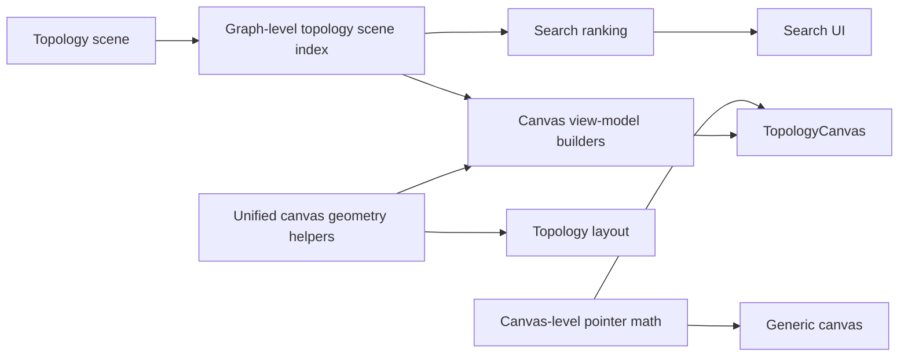
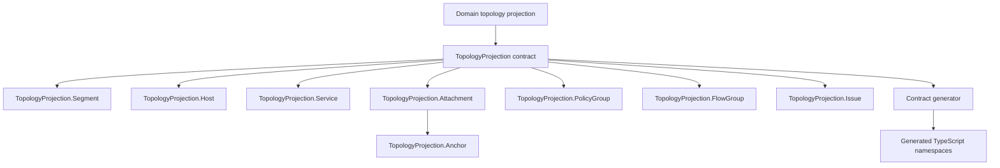

# PR 1 Review Refactor Plan

## Design

### Purpose

Address all 22 review comments without changing topology behavior, projection meaning, or the wire shape.

The refactor has two goals:

1. Move repeated traversal and geometry code into small pure modules.
2. Align projection contract names with the `TopologyProjection.*` namespace.

### Fixed decisions

- Keep `host_ids`, `service_ids`, `edge_ids`, `flow_ids`, and `related_ids` as sorted string arrays.
- Treat these arrays as normalized cross-references. They are not owned embedded records.
- Keep `Attachment.anchors` as an owned embedded collection.
- Keep all projection wire fields unchanged.
- Rename contract modules to `TopologyProjection.Host`, `TopologyProjection.Segment`, and the other matching submodules.
- Generate and commit TypeScript contracts. Do not edit generated files by hand.
- Preserve all canvas behavior and UX from the approved topology design.
- Run the Svelte autofixer on every changed `.svelte`, `.svelte.ts`, and `.svelte.js` file before verification.

### Frontend structure



`TopologyCanvas.svelte` remains the event and render boundary. Pure TypeScript modules build geometry, host views, relationship views, and entity indexes.

### Shared frontend interfaces

```ts
interface TopologySceneIndex {
  segments: readonly IndexedSegment[];
  hosts: readonly IndexedHost[];
  services: readonly IndexedService[];
  nodesById: ReadonlyMap<string, Node>;
  projectedEntityIds: ReadonlySet<string>;
}

function indexTopologyScene(scene: TopologyScene): TopologySceneIndex;

function buildStructuralLinks(
  index: TopologySceneIndex,
  nodeRects: ReadonlyMap<string, Rect>,
  runsEdges: ReadonlyMap<string, GraphEdge>,
): readonly StructuralLink[];
```

The index lives at the graph level, outside `unified/`, so graph modules do not depend on a renderer folder. `projectedEntityIds` contains projected segments, hosts, and services only. Canvas cleanup uses a separate drawn-ID builder that also adds attachments and unplaced floaters.

### Geometry ownership

- `canvas/canvasState.ts` remains the canonical source of `Point`.
- `unified/canvas-geometry.ts` owns `Size`, `Rect`, rectangle construction, inflation, containment, and overlap tests.
- `layout.ts` owns topology placement policy only.
- `unified/ordering.ts` can own a deterministic string comparator shared by layout and bundle code. Graph-level scene comparators remain independent.
- A canvas-level pointer-math module, next to `canvasState.ts`, owns pointer delta, drag threshold, and screen-to-world delta conversion. Both canvas implementations can depend on it.

Layout uses strict interior containment. `canvas-geometry.ts` already has an inclusive point hit-test. These predicates have different behavior at rectangle boundaries and must remain separate and named accordingly.

### Scene and canvas view models

The scene index flattens projected membership while preserving projection order and parent context. Search and canvas derivations consume this index instead of repeating segment-host-service loops.

The canvas view-model layer builds:

- node and frame rectangles;
- host and service rows;
- connection-handle data without event callbacks;
- service ownership links;
- focused attachment-anchor links;
- drawn entity IDs.

Service ownership links still require the authored `Runs` edge as link identity. The projected host-to-service membership controls traversal. The `Runs` edge supplies label and appearance. Missing `Runs` edges do not create visible connectors. `Contains` connectors stay removed.

Context-link builders receive the active lens, visible IDs, entity rectangles, and label data explicitly.

### Contract structure



Each submodule lives in its own file under `topology_projection/`. The root contract embeds these submodules. Fully qualified aliases avoid accidental resolution to a top-level `TopologyProjection` module.

The generator changes child aliases and paths:

- child aliases move from the graph barrel to the topology-projection barrel;
- child names become `Host`, `Segment`, `Service`, `Attachment`, `Anchor`, `PolicyGroup`, `FlowGroup`, and `Issue`;
- the root `TopologyProjection` alias remains in the graph barrel;
- generation deletes obsolete aliases before writing the new output.

Update non-generated imports in the scene adapter, placement helper, fixtures, layout tests, and contract tests. Generated files must be committed with the Elixir namespace change.

### ID-reference rationale

The projection is a normalized read model. Root arrays contain each projected record once. ID arrays express ordered references between those records and the editable graph.

Using `embeds_many` for these references would duplicate records and create conflicting ownership:

- a host would exist at the root and inside a segment;
- a service would exist at the root and inside a host;
- policy and flow IDs would duplicate editable graph relationships;
- issue references can point to different entity kinds.

Keep the ID arrays. Add concise type or test documentation where it prevents future confusion.

### Type conversion

Replace projection-local atom conversion clauses with registry-backed conversion.

The projection currently carries short snake-case atoms. Add one generic registry helper that converts a short atom to a contract tag and resolves it through the registry. Expose node and canonical relationship wrappers. The projection then calls those wrappers for attachment node and relationship types. Test known and unknown tags. Do not add another projection-local mapping table.

### Comment coverage

| Comments | Design response |
|---|---|
| `4111188415`–`4111194754` | Consolidate geometry types and rectangle helpers; flatten layout traversal. |
| `4111196522`–`4111196757` | Extract search ranking and use a flat scene index. |
| `4111198083`–`4111202356`, `4111203497` | Extract pure canvas view-model builders and entity collection. |
| `4111202899`–`4111203073` | Share pointer threshold and world-delta helpers. |
| `4111204706` | Use `TopologyProjection.*` contract submodules. |
| `4111209798` | Use registry-backed type-to-wire conversion. |
| `4111210455`–`4111212366` | Keep normalized ID arrays and document why they are references, not embeds. |

### Test cases

- **When** the same scene is indexed twice, **the system shall** return the same entity order and parent links.
- **When** Arrange or measure runs after helper extraction, **the system shall** return the same serialized member positions and frames.
- **When** a point lies on a rectangle boundary, **the system shall** preserve strict layout containment and inclusive pointer hit-testing.
- **When** search ranks a prefix, substring, and type match, **the system shall** preserve the current rank order.
- **When** the canvas builds cards and links, **the system shall** preserve the current visible entities and relationship paths.
- **When** projected membership exists without a matching `Runs` edge, **the system shall not** create a service ownership connector.
- **When** a pointer drag crosses the threshold, **the system shall** preserve the current pan and node-drag behavior.
- **When** contracts regenerate after module renaming, **the system shall** preserve projection JSON field names and values.
- **When** the projection contains ID-reference arrays, **the system shall** preserve deterministic sorting and nullability.

## Execution

Run the chunks in order. Review each diff before the next chunk.

1. `01-contract-modules.md` — rename Elixir projection contracts and centralize type conversion.
2. `02-contract-consumers.md` — regenerate TypeScript contracts and update all consumers.
3. `03-geometry-layout.md` — consolidate geometry types/helpers and flatten layout member traversal.
4. `04-scene-index-search.md` — add a graph-level scene index and simplify search.
5. `05-canvas-spatial-view-model.md` — extract entity rectangles and host/service views.
6. `06-canvas-handle-view-model.md` — extract connection-handle data.
7. `07-canvas-link-view-model.md` — extract structural/context links and drawn IDs.
8. `08-gesture-math.md` — share pointer threshold and world-delta math.
9. `09-automated-verification.md` — run the Svelte autofixer, generation, backend, frontend, and static checks.
10. `10-browser-review.md` — run browser smoke checks and produce the 22-comment resolution table.

Do not start implementation until this plan is approved.
