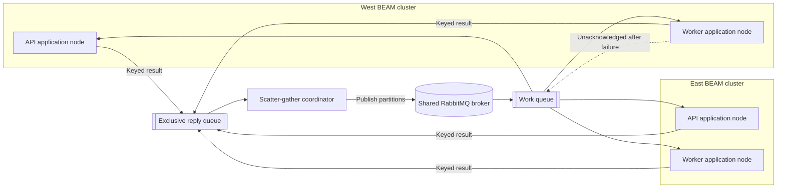
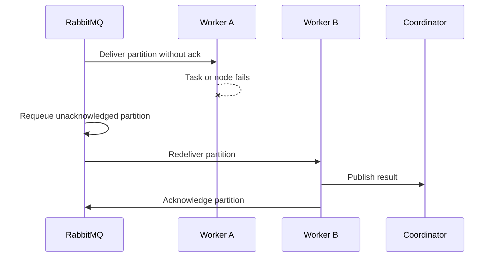

# RabbitMQ Distributed Scatter-Gather Executor

## Design

### Goal

Add an ephemeral ScatterGather executor that distributes partitions across the
application nodes in all site-local BEAM clusters. Keep Erlang distribution
site-local. Use one shared RabbitMQ broker for cross-site work delivery and
result transport.

The executor must preserve the current ScatterGather operation and executor
contracts. It must not write intermediate partitions or results to PostgreSQL.
The existing `gather/3` callback remains the only final persistence boundary.

### Decisions

| Concern | Decision |
|---|---|
| Cross-site transport | One shared RabbitMQ broker over AMQP 0-9-1 |
| Shovel | Do not use it while all sites share one broker |
| Eligible workers | One consumer on every application node, including API nodes |
| Load balancing | One shared queue with competing consumers and prefetch set to one |
| Worker recovery | Requeue unacknowledged work after task, node, channel, or connection failure |
| Intermediate state | Coordinator memory and transient RabbitMQ messages only |
| Final persistence | Existing operation `gather/3` callback |
| Coordinator recovery | None; coordinator loss abandons the ephemeral run |
| Dependencies | Add the Elixir `amqp` library |

### Topology

RabbitMQ joins every site network. Application nodes connect only to the shared
broker and their site-local Erlang distribution mesh. No application node needs
direct cross-site connectivity.

### Components

`NetworkDefense.Compute.RabbitMQExecutor` implements the existing executor
behaviour. Its `run/3` function scatters the input, publishes a bounded work
window, collects keyed results, reports progress, and calls `gather/3`.

`NetworkDefense.Compute.RabbitMQWorker` is one supervised consumer on each
application node. It executes one partition at a time in a supervised task. It
publishes the result before it acknowledges the work message.

The shared work queue distributes work between available consumers. A
server-named, transient, exclusive, auto-delete reply queue belongs to one
executor run. Its consumer uses the coordinator's channel.

Do not add a distributed registry, application scheduler, result table,
long-lived coordinator, or per-node queues.

The caller invokes the executor directly. Oban is not part of this design. A
future durable coordination layer can retry or fail abandoned runs.

### Coordinator Flow

The coordinator performs these actions:

1. Call `operation.scatter/1` and retain the input in memory.
2. Generate one internal run ID and one partition ID for each scattered item.
3. Open an AMQP channel and declare a server-named, exclusive, auto-delete reply queue.
4. Call `operation.gather/3` immediately if `scatter/1` returns no partitions.
5. Publish no more than the configured `max_concurrency` partitions.
6. Validate replies by run ID and partition ID.
7. Publish one pending partition after one unique successful result arrives.
8. Report weighted progress once for each unique successful partition.
9. Ignore duplicate results by partition ID.
10. Stop without `gather/3` after a partition or progress-callback error.
11. Call `operation.gather/3` once after all unique partitions succeed.
12. Delete the reply queue and close the channel.

The bounded work window limits stale queued work after an operation failure.
Work messages also expire. Other active workers can finish after a terminal
error, but their results have no reply queue and cannot reach `gather/3`.

### Work Distribution

Each application node owns one consumer. Each consumer has a prefetch count of
one. RabbitMQ distributes messages in queue order to available consumers. This
is round-robin while consumers are equally available. A slow consumer receives
less new work.

The shared queue makes consumers in every site eligible. It does not guarantee
that every run uses every site. Strict site participation requires per-site
queues or explicit routing.

Do not implement strict static node assignment. Strict assignment requires
node membership, per-node queues, and application-owned routing.

### Failure Semantics

| Event | Action |
|---|---|
| `execute/1` returns `{:ok, result}` | Confirm the result publication, then acknowledge work |
| `execute/1` returns `{:error, reason}` | Publish the error and acknowledge work without retry |
| The execution task exits | Publish a compact task-exit error and acknowledge work without retry |
| The worker node, channel, or connection fails | RabbitMQ requeues unacknowledged work |
| A result is published before its work is acknowledged | A duplicate execution is possible; the coordinator keeps one result per partition ID |
| Result publication fails | Do not acknowledge work; close the channel so RabbitMQ requeues it |
| No result arrives before the result-inactivity timeout | Fail the operation with `:result_timeout` |
| The coordinator process fails | A local caller can observe the exit; lose the in-memory run state and reply queue |
| The coordinator node fails | Abandon the run; durable recovery is outside this design |
| A message is malformed or unsupported | Acknowledge and discard it without execution |

RabbitMQ can redeliver work to the same consumer after it becomes available.
Only infrastructure loss causes redelivery. The simple design does not
guarantee exclusion of a previous node.

The operation `execute/1` callback must not make durable changes. At-least-once
delivery can execute one partition more than once. The current simulation
operation follows this rule because only `gather/3` persists computed runs.

### Ephemeral Messaging

Use one named durable work queue because current RabbitMQ versions reject
shared transient queues by default. Publish work and result messages as
transient. Set message expiration and do not mount a RabbitMQ data volume in the
local environment.

RabbitMQ can temporarily page transient messages to disk. In this design,
ephemeral means that the application creates no durable intermediate records
and that broker restart can discard in-flight work.

No durable coordinator or intermediate partition store is part of this design.

### Message Contract

Use Erlang External Term Format because every consumer runs the same Elixir
application. Decode with `:erlang.binary_to_term/2` and the `:safe` option.

A work message contains a protocol version, internal run identifier, partition
identifier, partition key, work units, operation identifier, partition value,
and trace headers. AMQP properties carry the reply queue. The application
correlation ID is observability data and is not a protocol identifier.

Map the operation identifier through a fixed allowlist. Do not accept a module
name from a message. Initially, allow only the simulation operation. Validate
the complete decoded message before execution. Acknowledge and discard invalid
messages without requeue.

All nodes must run compatible application and message-contract versions.

### Connections and Security

Configure one supervised named AMQP connection on each application node. The
worker opens and monitors its own channel and subscribes again after channel
recovery. Each executor run opens an isolated channel for publishing and its
exclusive reply consumer. The reply queue is transient and auto-delete. Normal
cleanup explicitly deletes it and closes the channel.

Read the RabbitMQ password from a mounted secret file through
`NetworkDefense.RuntimeConfig`. Pass host, port, virtual host, and username as
environment variables. Do not put credentials in AMQP URLs or Terraform
values.

Use a dedicated RabbitMQ user and virtual host. Grant only the configure,
publish, and consume permissions required by the executor topology. Use TLS for
traffic that leaves a private deployment network.

Set broker and application message-size limits. Reject malformed, oversized,
expired, and unknown-version messages before execution. If an encoded result
exceeds the application limit, publish a compact `result_too_large` partition
error instead of the result.

### Telemetry and Metrics

Inject W3C trace context into work-message headers. The worker extracts the
context before it starts the existing `scatter_gather.partition` span.

The existing run span stays on the coordinator. Partition spans run on the
consumer nodes. Add worker node, site, replica, redelivery status, and payload
sizes where applicable. Keep partition keys and node names out of metric tags.

Add a bounded partition-reassignment counter. A redelivered message increments
it. Existing partition metrics show work distribution when Prometheus groups
them by the collector's `site` and `replica` labels.

Enable RabbitMQ's Prometheus plugin. Attach the shared broker to the central
observability network and let central Prometheus scrape it directly. Collect
queue depth, unacknowledged messages, consumer count, delivery rate,
acknowledgement rate, and redelivery rate.

Add Grafana panels for successful partitions by application replica,
redelivered partitions, ready and unacknowledged work, and active consumers.

### Why Not Shovel

Shovel moves messages in one direction between separate RabbitMQ brokers. A
shared broker already reaches all application clusters, so Shovel adds no route
to this topology.

If each site later requires its own broker, replace the exclusive reply pattern
with fixed ingress and result exchanges. Add one Shovel in each required
direction with confirmation-based acknowledgement. Also add result routing by
origin site and retain duplicate-result handling. Do not add this topology
before separate brokers are required.

### Test Cases

- WHEN consumers in separate BEAM clusters are active, THE shared queue SHALL make consumers in both clusters eligible for work.
- WHEN a worker node disconnects, A surviving worker SHALL complete the unacknowledged partition.
- WHEN an operation returns a tagged error, THE worker SHALL acknowledge the message and SHALL NOT requeue it.
- WHEN an execution task exits, THE worker SHALL publish a terminal partition error and SHALL NOT requeue it.
- WHEN duplicate results arrive, THE coordinator SHALL count the partition once.
- WHEN every partition succeeds, THE executor SHALL call `gather/3` once.
- WHEN scatter returns no partitions, THE executor SHALL call `gather/3` with an empty result list.
- WHEN the progress callback returns an error, THE executor SHALL stop and SHALL NOT call `gather/3`.
- WHEN the broker connection fails, THE executor SHALL return an error and SHALL NOT call `gather/3`.
- WHEN a message contains an unapproved operation identifier, THE worker SHALL reject it without execution.
- WHEN a message exceeds the accepted size, THE worker SHALL reject it without decoding or execution.

## Execution

1. Add the shared RabbitMQ Terraform module, mounted credential file, health check, site-network attachments, and Prometheus endpoint.
2. Add the AMQP dependency, runtime connection configuration, message validation, executor, and supervised worker.
3. Extend compute telemetry, RabbitMQ scraping, Grafana panels, architecture documentation, and infrastructure documentation.
4. Add focused executor tests and a broker integration test. Preserve all LocalExecutor contract tests.
5. Run the project precommit checks. Launch both sites, terminate one active worker, and verify redelivery, final completion, cross-site traces, and per-replica metrics.
