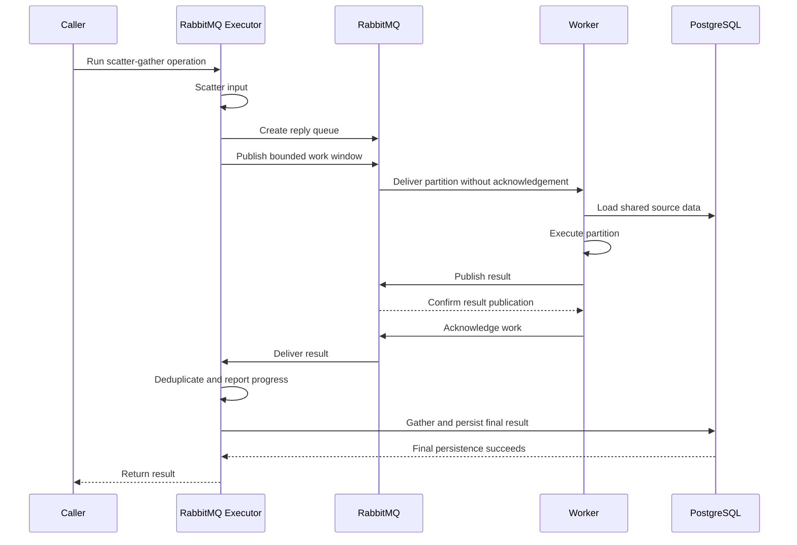
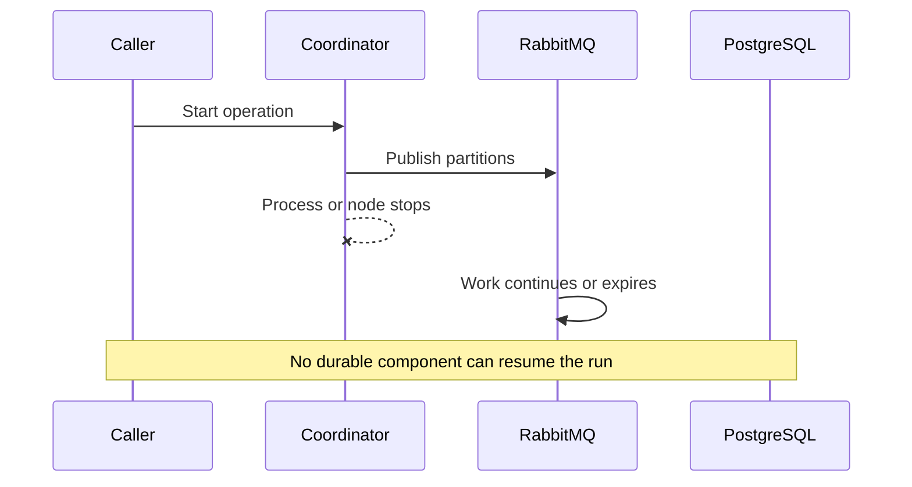
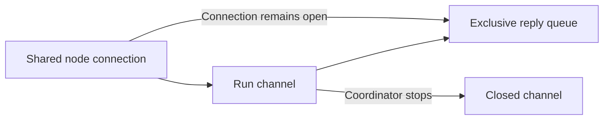
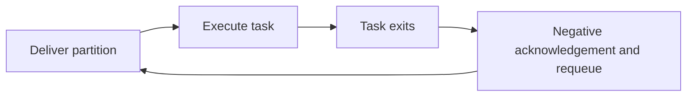
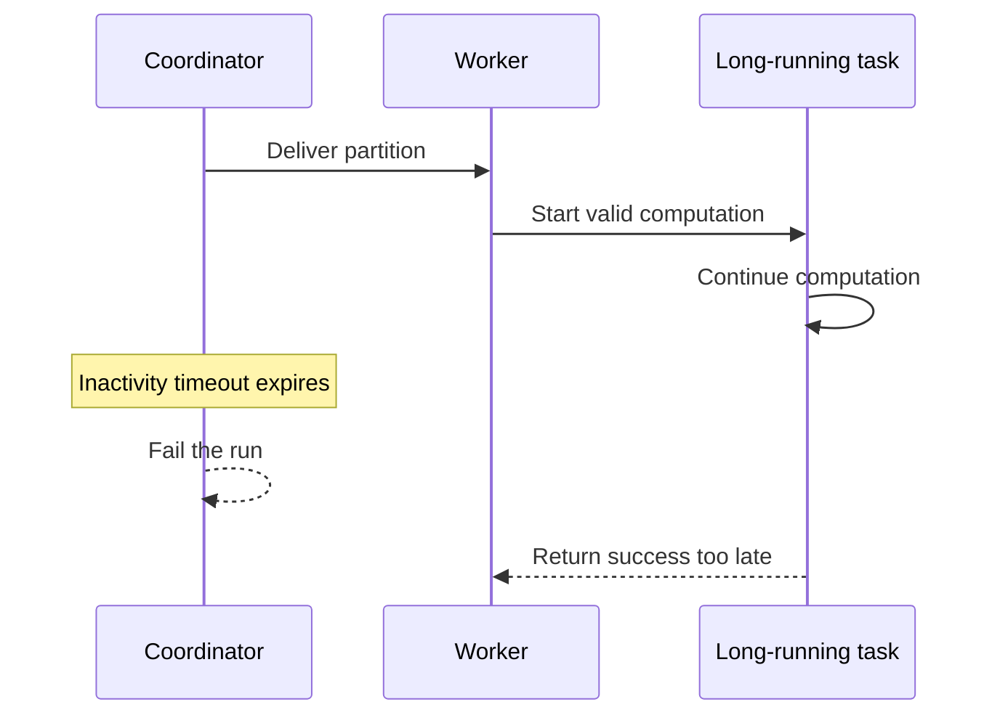
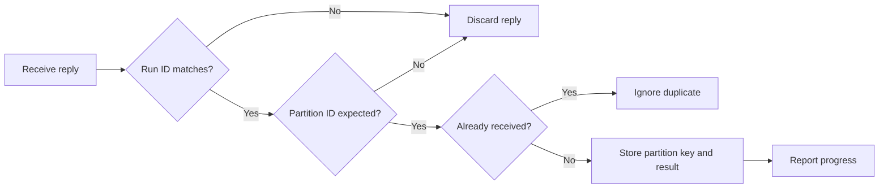
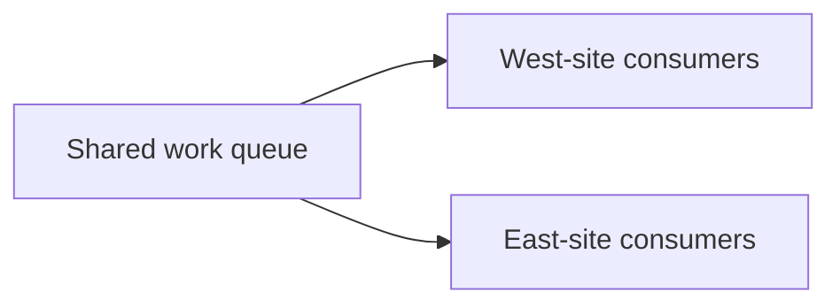

# RabbitMQ Distributed Executor Review Findings

## Scope

RabbitMQ scatter-gather replaces the current execution path. Oban is not part of
this executor design. Oban can become a future coordination layer.

The current path is:

## Finding 1: Oban Is Incorrectly in the Current Design

### Current text

The detailed design says that an outer Oban job remains durable. This statement
is at `planning/rabbitmq-distributed-executor-design.md:157`.

### Problem

This statement makes Oban appear responsible for the current coordinator
lifecycle. That is not the intended architecture.

### Fix

- Remove Oban from the current RabbitMQ design and execution plan.
- Describe Oban as possible future coordination work only.
- Use the direct caller-to-executor path shown above.

### Result

RabbitMQ distributes partitions and transports results. It does not provide a
durable run coordinator. The coordinator remains ephemeral.

## Finding 2: Coordinator Loss Has No Durable Recovery

### Intended path

The coordinator keeps pending partitions, received results, and progress in
memory. It calls `gather/3` after all partitions succeed.

### Failure path

### Failure point

If only the coordinator process stops, a local caller or supervisor can observe
the exit and return an error. If the complete node stops, no local process can
report the error or update domain state.

Any domain record that was marked as running before execution can remain stale.
This is an unavoidable limit without durable coordination.

### Fix for the current scope

- State that coordinator loss abandons the run.
- Do not attempt to resume partial results.
- Delete the reply queue automatically when its consumer disappears.
- Let published work finish or expire without calling `gather/3`.
- Return an error when the caller remains alive and can observe the failure.
- Document that hard node loss can leave pre-existing run state stale.

### Deferred fix

A future durable coordinator can detect abandoned runs and retry or fail them.
Oban can provide that coordination later. It is not part of this implementation.

## Finding 3: Reply-Queue Cleanup Is Not Fully Defined

### Intended path

Each application node owns one shared AMQP connection. Each executor run opens
one channel and declares one exclusive reply queue.

### Failure path

### Failure point

An exclusive queue belongs to its AMQP connection. The shared connection can
remain alive after the run channel or coordinator stops. Exclusivity alone does
not define immediate cleanup.

### Fix

Declare each reply queue with these properties:

- Use a server-generated name.
- Set `durable` to `false`.
- Set `exclusive` to `true`.
- Set `auto_delete` to `true`.

Keep the reply consumer on the coordinator's channel. Link or monitor the
channel from the coordinator. Delete the queue during normal cleanup and close
the channel in an `after` block when possible.

If result routing fails because the queue no longer exists, the worker can
acknowledge the work. The associated run no longer exists.

## Finding 4: Task Exit Can Cause a Poison-Message Loop

### Current proposed path

### Failure point

A deterministic task exit repeats on every worker. The coordinator never
receives a result or terminal partition error. Work continues until the message
expires or the coordinator times out.

### Fix

Use different behavior for computation failure and infrastructure failure:

| Event | Worker action |
|---|---|
| `execute/1` returns an error | Publish the error, confirm publication, and acknowledge work |
| The execution task exits | Publish a compact task-exit error, confirm publication, and acknowledge work |
| Result publication fails | Do not acknowledge work; close the channel |
| The worker node, channel, or connection stops | Let RabbitMQ requeue unacknowledged work |
| A message is malformed or unsupported | Acknowledge and discard it without execution |

Only infrastructure loss causes redelivery. A known computation failure becomes
a terminal partition result.

## Finding 5: The Inactivity Timeout Changes Executor Behavior

### Existing behavior

The local executor has no partition timeout. A valid partition can run for any
duration.

### Proposed failure path

### Failure point

The timeout cannot distinguish unavailable workers from a valid long-running
partition. The error `:workers_unavailable` is therefore too specific.

### Minimal fix

- Name the setting `result_inactivity_timeout`.
- Set it above the measured maximum partition duration.
- Reset it only after a valid, unique result or partition error.
- Do not reset it after duplicate or malformed messages.
- Return `:result_timeout` when it expires.

If partitions cannot have a practical maximum duration, worker heartbeat
messages are necessary. Do not add heartbeats until measurements require them.

## Finding 6: Protocol Identity Is Ambiguous

### Existing identifiers

| Identifier | Purpose |
|---|---|
| Application correlation ID | User interface events, logs, and traces |
| Internal run ID | One executor attempt |
| Partition ID | One protocol work item |
| Partition key | Semantic key passed to `gather/3` |

The detailed design includes run and partition identifiers at
`planning/rabbitmq-distributed-executor-design.md:165`. It also says that the
coordinator matches replies by correlation ID and partition key at line 91.

### Failure point

An application correlation ID is not a protocol identity. A semantic partition
key also should not identify a RabbitMQ delivery. Retries and duplicate
deliveries require transport-specific identifiers.

### Fix

- Generate a unique internal run ID for each executor invocation.
- Generate a unique partition ID for each scattered item.
- Include both identifiers in work and result messages.
- Validate the run ID before accepting a reply.
- Deduplicate replies by partition ID.
- Pass the original partition key and result to `gather/3`.
- Use the application correlation ID only for observability.

### Correct reply path

## Finding 7: The Distributed Executor Must Preserve Executor Behavior

### Required behavior

| Case | Required result |
|---|---|
| `scatter/1` returns no partitions | Call `gather/3` with an empty result list |
| A partition returns an error | Stop publishing, skip `gather/3`, and return the error |
| The progress callback returns an error | Stop publishing, skip `gather/3`, and return the error |
| `gather/3` returns an error | Return the error |
| `max_concurrency` is absent | Use the existing default |
| Results finish out of order | Preserve each key without requiring result order |
| The caller cancels the run | Stop the coordinator and let published work expire |

### Progress failure path

1. The coordinator receives a valid result.
2. The coordinator stores the result.
3. The coordinator calls the progress callback.
4. The callback returns an error.
5. The coordinator stops publishing work.
6. The coordinator deletes its reply queue.
7. The executor returns the callback error.
8. The executor does not call `gather/3`.

### Fix

Apply the existing executor behavior to both implementations. Add focused
RabbitMQ tests for message delivery, redelivery, duplicate replies, and queue
cleanup. Do not change the operation callbacks.

## Finding 8: A Shared Queue Does Not Guarantee Site Participation

### Intended topology

### Failure example

1. A run contains a small number of partitions.
2. West-site consumers become ready first.
3. RabbitMQ sends all partitions to west-site consumers.
4. East-site consumers become ready after delivery.
5. The run completes without east-site participation.

The broker operated correctly. The shared queue makes every site eligible, but
it does not guarantee that every run uses every site.

### Fix

State the requirement as eligibility:

> WHEN consumers from multiple sites are active, THE shared queue SHALL permit
> consumers from each site to receive partitions.

For the integration test, wait for consumers in both sites. Publish enough
blocking partitions to occupy multiple consumers. Verify that the controlled
test observes execution in both sites.

If each run must use every site, use per-site queues or explicit routing. That
is a different topology and is outside the current design.

## Recommended Decisions

1. Remove Oban from the current design.
2. Accept that coordinator loss abandons ephemeral run state.
3. Use exclusive, transient, auto-delete reply queues.
4. Treat task exits as terminal partition errors.
5. Use redelivery only for infrastructure loss.
6. Define a result-inactivity timeout or explicitly remove it.
7. Use internal run and partition IDs for protocol matching.
8. Preserve the existing operation and executor behavior.
9. Describe cross-site distribution as eligibility, not a per-run guarantee.
