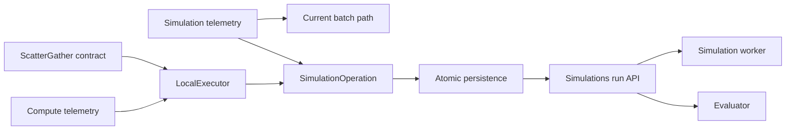

# Scatter-Gather Implementation

## Design

The implementation combines the simple ScatterGather executor with the simulation context rewrite. It has two phases.

Phase 1 defines the operation contract and moves observability behind focused helpers. The current batch executor, persistence, worker, and evaluation paths remain active.

Phase 2 adds the local executor and simulation operation. It switches all callers to atomic, all-or-nothing execution and then removes the old batch and partial-resume paths.

### Phase 1 Boundary

Add `NetworkDefense.Compute.ScatterGather`. Its callbacks are `scatter/1`, `execute/1`, and `gather/3`. A partition contains a unique key, a positive work-unit count, and an ephemeral value.

Add `NetworkDefense.Compute.Telemetry`. It owns generic ScatterGather spans, telemetry events, and structured logs. It keeps partition keys out of metric metadata. It preserves exception stacktraces. It uses `NetworkDefense.Observability.duration_ms/1` instead of adding another duration converter.

Add `NetworkDefense.Simulation.Telemetry`. It owns simulation-specific `Logger` and `OpenTelemetry.Tracer` calls and the existing simulator-duration event. It does not own persistence, PubSub, or progress.

Wire the current simulation execution, report generation, and enqueue-failure paths through the simulation helper. Preserve the current worker, evaluator, batch persistence, progress, PubSub payloads, span names, telemetry event names, and public API.

The current `simulation.batch.completed` log needs a temporary helper because batch persistence remains during Phase 1. Phase 2 deletes this helper with the batch path.

Register the bounded ScatterGather metrics. Do not add a process, dependency, database migration, or executor in Phase 1.

### Phase 1 Checks

- WHEN the application launches, THE runtime endpoints SHALL report the expected telemetry, logs, and metrics.
- WHEN simulation compute completes, THE helper SHALL emit simulator duration in native units.
- WHEN report generation completes, THE report value and progress calls SHALL remain unchanged.
- WHEN the current simulation path runs, THE persistence and PubSub results SHALL remain unchanged.

### Phase 2 Boundary

Phase 2 implements `LocalExecutor`, atomic experiment completion, `SimulationOperation`, `Simulations.run/2`, worker migration, and evaluator migration. It removes batch persistence and partial-trial resume only after the final caller migrates.

The detailed contracts and decisions remain in `planning/map-reduce-design.md` and `planning/simulations-scatter-gather-design.md`.

## Execution

Implement only Phase 1 until the user reviews it. Do not start Phase 2.
