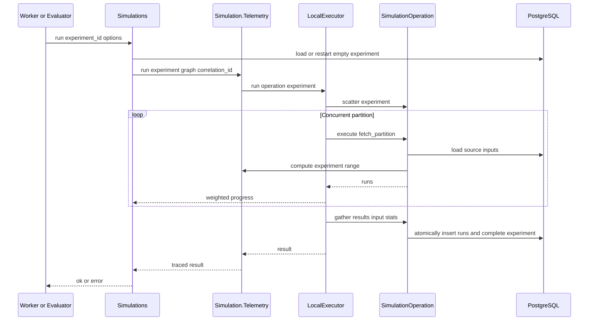
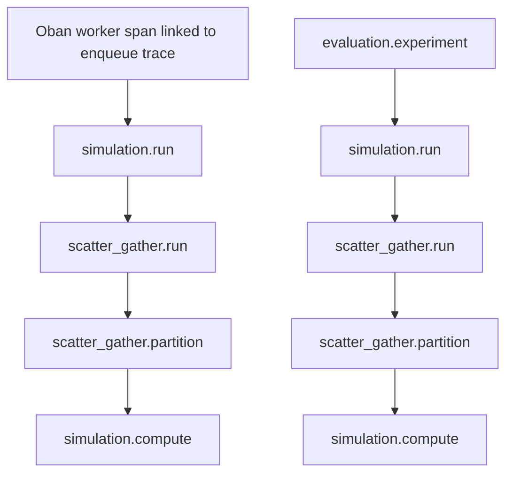

# Simulations Scatter-Gather Rewrite

## Design

### Goal

Rewrite `NetworkDefense.Simulations` as a small public context around preparation, execution, queries, reports, and events. Move partition execution to ScatterGather. Remove batch checkpoints, trial-level resume, inline tracing, and inline logging.

The rewrite preserves current simulation spans, metrics, PubSub payloads, and report behavior. Progress remains ephemeral.

### Target Flow



### Public Context Interface

Keep this public surface:

```elixir
@spec simulation_events_topic() :: String.t()
def simulation_events_topic()

@spec run_async(RunSimulationRequest.t()) ::
        {:ok, Oban.Job.t()} | {:error, Errors.error()}
def run_async(request)

@spec run(Ecto.UUID.t(), keyword()) ::
        {:ok, Experiment.t()} | {:error, term()}
def run(experiment_id, opts)

@spec list_experiments([Ecto.UUID.t()]) :: [Experiment.t()]
def list_experiments(graph_revision_ids)

@spec get_report(Ecto.UUID.t(), ReportProgress.progress_callback()) ::
        SimulationReport.t() | nil
def get_report(experiment_id, on_progress \\ ReportProgress.noop())
```

`run/2` replaces `run_or_resume/2` and `run_batches/4`. It requires `:correlation_id`. It accepts:

- `:max_concurrency` for `LocalExecutor`.
- `:on_progress` for ephemeral caller progress.
- `:publish_events` to publish dashboard simulation events. The default is `false`.

`SimulationWorker` sets `publish_events: true`. The evaluator sets an `on_progress` callback and leaves event publication disabled.

Delete these public functions:

- `prepare/2`: no production caller uses it.
- `run_or_resume/2`: trial-level resume is removed.
- `run_batches/4`: `SimulationOperation` replaces it.
- `parallel_map_fn/2`: `LocalExecutor` owns concurrency.
- `validate_initial_foothold/2`, `initial_attacker_state/2`, and `default_rules/0`: move them to `NetworkDefense.Simulation.Simulator`.

Keep mission-feasibility validation private in `Simulations`. Keep synchronous `Simulator.run_experiment/3` for optimization until optimization adopts ScatterGather.

### Context Control Flow

`run_async/1` keeps its current contract. It validates the request, creates the experiment, and inserts one traced Oban job. If enqueue fails, it calls `Simulation.Telemetry.enqueue_failed/2`, marks the experiment failed, and returns `{:error, :task_unavailable}`.

`run/2` contains only orchestration:

```elixir
def run(experiment_id, opts) do
  correlation_id = Keyword.fetch!(opts, :correlation_id)

  with {:ok, experiment} <- Experiments.start_empty(experiment_id) do
    if experiment.status in ["completed", "cancelled"] do
      {:ok, experiment}
    else
      run_empty(experiment, correlation_id, opts)
    end
  end
end

defp run_empty(experiment, correlation_id, opts) do
  case load_graph(experiment.graph_revision_id) do
    {:ok, graph} ->
      result =
        try do
          SimulationTelemetry.run(experiment, graph, correlation_id, fn ->
            LocalExecutor.run(SimulationOperation, experiment,
              correlation_id: correlation_id,
              max_concurrency:
                Keyword.get(opts, :max_concurrency, System.schedulers_online()),
              on_progress: progress_callback(graph, experiment, opts)
            )
          end)
        rescue
          _error -> {:error, :internal_error}
        end

      finish_run(result, graph, experiment, correlation_id, opts)

    {:error, reason} = error ->
      Experiments.fail(experiment.id)
      error
  end
end
```

This code shows ownership, not final syntax. The context aliases `NetworkDefense.Simulation.Telemetry` as `SimulationTelemetry`. `progress_callback/3` composes the caller callback with the existing `:simulation_progress` broadcast when `publish_events: true`.

`SimulationTelemetry.run/4` records and reraises unexpected exceptions with their original stacktraces. The small rescue in `run_empty/3` converts them to the public `{:error, :internal_error}` contract. `finish_run/5` then marks the experiment failed and publishes the failure event when enabled.

`finish_run/5` has no tracing or logging:

- On success, it publishes the existing `:simulation_completed` payload when event publication is enabled.
- On error, it marks the experiment failed and publishes the existing `:simulation_failed` payload when event publication is enabled.
- It returns the original tagged result.

A graph-load failure marks the experiment failed and returns the load error. It does not publish an event because the graph data needed by the current payload is unavailable. This matches the current worker failure path.

### Progress

`SimulationOperation.scatter/1` returns `{partition_key, trial_count, partition}`. `LocalExecutor` adds trial counts as unordered partitions finish.

The generic executor callback receives:

```elixir
%{completed: completed_trials, total: total_trials}
```

The dashboard adapter preserves the current message:

```elixir
{:simulation_progress,
 %{
   correlation_id: correlation_id,
   graph_id: graph.id,
   graph_revision_id: graph.revision_id,
   completed: completed_trials,
   total: total_trials
 }}
```

The evaluator maps the same values into its global progress:

```elixir
on_progress: fn %{completed: completed, total: experiment_total} ->
  emit_progress(
    run_id,
    graph,
    base + completed,
    total,
    "#{label}: #{completed} of #{experiment_total}"
  )
end
```

Progress is not durable. A later partition or callback failure can invalidate previously reported progress. A retry starts that experiment at zero.

### Experiment Lifecycle

Replace batch persistence with two focused functions:

```elixir
@spec start_empty(Ecto.UUID.t()) :: {:ok, Experiment.t()} | {:error, term()}
def start_empty(experiment_id)

@spec complete_with_runs(Experiment.t(), [Run.t()], non_neg_integer()) ::
        {:ok, Experiment.t()} | {:error, term()}
def complete_with_runs(experiment, runs, runtime_ms)
```

`start_empty/1` locks the experiment. It allows an empty running or failed experiment. It resets a failed experiment to running. It returns a completed or cancelled experiment without recomputation. It rejects any incomplete experiment that already has persisted runs.

Old partial experiments are not migrated. `start_empty/1` returns `{:error, :partial_experiment_unsupported}`. Evaluation fails and must be started again. New ScatterGather execution cannot create this state.

`complete_with_runs/3` uses one transaction. It locks the experiment, verifies the expected trial count, inserts all runs and iteration steps with the existing chunking helpers, sets `completed_trials`, stores wall-clock compute duration, and sets the status to completed. Any error rolls back the full gather.

Delete `append_batch/3` and `complete/1` after all callers migrate. Replace `resume_or_load/1` with `start_empty/1` after evaluation migration.

V1 can compute the same empty experiment twice if duplicate callers start concurrently. The final transaction permits only one completion. Add an exclusive claim only if duplicate computation occurs in practice.

### Simulation Operation

`NetworkDefense.Compute.SimulationOperation` owns only ScatterGather callbacks:

- `scatter/1` validates that `completed_trials` is zero and creates weighted range descriptors.
- `execute/1` fetches the descriptor, loads the experiment and graph, materializes reachability, derives the initial attacker state, and calls `Simulator.run_batch/5` without a parallel `map_fn`.
- `gather/3` flattens unordered run lists and calls `Experiments.complete_with_runs/3`.

Only the partition layer runs concurrently. Trials inside one partition run sequentially.

### Simulation Telemetry

Add `NetworkDefense.Simulation.Telemetry`. This internal module owns all simulation-specific `Logger` and `OpenTelemetry.Tracer` calls. It also emits the existing simulator telemetry event. It does not persist data, publish events, or call progress callbacks.

Use domain wrappers so callers do not construct attributes or log fields:

```elixir
@spec run(Experiment.t(), Graph.t(), String.t(), (-> term())) :: term()
def run(experiment, graph, correlation_id, fun)

@spec compute(Experiment.t(), Range.t(), (-> term())) :: term()
def compute(experiment, trial_indexes, fun)

@spec report(Experiment.t(), (-> term())) :: term()
def report(experiment, fun)

@spec enqueue_failed(String.t(), term()) :: :ok
def enqueue_failed(correlation_id, reason)
```

`run/4` preserves the `simulation.run` span and these attributes:

- `graph.id`
- `graph.revision_id`
- `simulation.experiment_id`
- `network_defense.correlation.id`
- `simulation.run_count`
- `simulation.iteration_count`
- `simulation.max_attempts`
- `simulation.completed_run_count` on success

It writes `simulation.run.started` and `simulation.run.completed` debug logs. A tagged error sets error status and writes one structured error log. An exception records the original exception and stacktrace, sets error status, writes one error log, and reraises with the original stacktrace.

`compute/3` preserves the `simulation.compute` span with batch size and trial-bound attributes. It emits `[:network_defense, :simulator, :run]` with duration in native time units. It does not write successful partition logs.

`report/2` moves the existing `simulation.report.generate` span and report start/completion logs out of `SimulationReport.generate/2`. It sets span status and records then reraises exceptions.

`enqueue_failed/2` owns the structured enqueue error log.

The resulting span nesting is:



`OpentelemetryProcessPropagator.Task.Supervisor` remains mandatory in `LocalExecutor`. It attaches each partition task to the active parent context. The helper must call `Tracer.set_status/1`, `Tracer.set_attributes/1`, and `Tracer.record_exception/2` before the span closes.

### Worker

`SimulationWorker.perform/1` becomes one call:

```elixir
case Simulations.run(experiment_id,
       correlation_id: correlation_id,
       publish_events: true
     ) do
  {:ok, _experiment} -> :ok
  {:error, _reason} -> {:error, :failed}
end
```

`Simulations.run/2` owns experiment failure. The worker must not call `Experiments.fail/1` again.

### Evaluation

Evaluation calls the same `Simulations.run/2` function. It supplies its progress callback and keeps `publish_events: false`.

Evaluation passes its run ID as `correlation_id`, matching the current evaluation trace and log convention.

The evaluator adapts the tagged result to its existing exception-based experiment boundary:

```elixir
case Simulations.run(experiment.id,
       correlation_id: experiment.evaluation_run_id,
       on_progress: on_progress
     ) do
  {:ok, completed} -> completed
  {:error, reason} -> raise "simulation failed: #{inspect(reason)}"
end
```

The existing `evaluation.experiment` rescue then sets error status, writes the evaluation failure log, and stops the evaluation. It must not treat an error tuple as a completed experiment.

Evaluation can resume after completed experiments. It cannot resume part of an experiment. An empty failed or interrupted experiment restarts from its first trial. Remove calculations that subtract partially persisted trials.

Keep the existing `evaluation.experiment` span. `simulation.run` becomes its child. The ScatterGather and compute spans remain below it.

### Files

Add:

- `src/lib/network_defense/simulation/telemetry.ex`
- ScatterGather files defined by `planning/map-reduce-design.md`

Rewrite:

- `src/lib/network_defense/simulations.ex`
- `src/lib/network_defense/simulations/simulation_worker.ex`
- `src/lib/network_defense/simulation/experiments.ex`
- `src/lib/network_defense/simulation/simulation_report.ex`
- `src/lib/network_defense/simulation/simulator.ex`
- `src/lib/network_defense/evaluation/evaluator.ex`
- optimization callers of the moved Simulator helpers
- tests that call removed Simulations functions or moved Simulator helpers

Delete no domain schema or persisted report fields.

### Test Cases

- WHEN `run_async/1` receives invalid simulation input, THE context SHALL return the current validation error before it inserts a job.
- WHEN a simulation job starts, THE worker SHALL call `Simulations.run/2` with simulation-event publication enabled.
- WHEN a partition completes, THE context SHALL publish the current simulation-progress payload with weighted trial counts.
- WHEN an evaluation partition completes, THE evaluator SHALL publish evaluation progress and SHALL NOT publish simulation events.
- WHEN one partition fails, THE context SHALL mark the experiment failed and SHALL NOT persist runs.
- WHEN graph loading fails, THE context SHALL mark the experiment failed and SHALL return the load error.
- WHEN final persistence fails, THE transaction SHALL roll back all runs and the completed status.
- WHEN an empty failed experiment restarts, THE operation SHALL recompute every trial.
- WHEN an old partial experiment is found, THE context SHALL return `:partial_experiment_unsupported` and SHALL NOT compute it.
- WHEN a completed evaluation experiment is found, THE evaluator SHALL skip its computation.
- WHEN `Simulations.run/2` returns an error to evaluation, THE evaluator SHALL enter its existing experiment-failure path.
- WHEN `Simulation.Telemetry.run/4` succeeds, THE helper SHALL preserve the run span attributes and completion log fields.
- WHEN simulation compute runs, THE helper SHALL preserve the compute span and simulator-duration event.
- WHEN a traced partition starts, THE compute span SHALL attach below the partition span.
- WHEN a simulation callback raises, THE helper SHALL record the original exception and SHALL reraise with its stacktrace.
- WHEN a simulation report is generated, THE report module SHALL contain no direct Tracer or Logger calls.
- WHEN the rewrite is complete, THE Simulations context SHALL contain no direct Tracer, Logger, task-stream, or batch-persistence code.

## Execution

1. Extend the ScatterGather partition contract with work units and an ephemeral progress callback. Add executor progress and callback-failure tests.
2. Add `Experiments.start_empty/1` and atomic `complete_with_runs/3`. Test rollback, restart, completed, and rejected partial states.
3. Add `SimulationOperation` and `Simulation.Telemetry`. Preserve span names, attributes, event names, units, and trace propagation.
4. Replace `run_or_resume/2` and `run_batches/4` with `Simulations.run/2`. Simplify `SimulationWorker` and preserve PubSub payloads.
5. Move shared setup helpers to `Simulator`. Update optimization callers. Delete unused Simulations exports and batch concurrency code.
6. Migrate evaluation to `Simulations.run/2`. Preserve weighted progress and experiment-boundary resume. Delete partial-trial resume calculations.
7. Move report tracing and logging into `Simulation.Telemetry.report/2`. Keep report output and progress unchanged.
8. Delete obsolete experiment batch APIs after the last caller migrates. Register or preserve metrics and run the project precommit checks.
