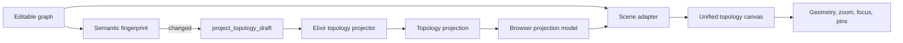

# Unified Topology Implementation Plan

## Design

The UX authority is `planning/unified-topology-design.md`. The projection boundary authority is `planning/grilling-topology-projection-boundary.md`. The repository map is `planning/unified-topology-file-map.md`.

The implementation replaces two canvas meanings with one topology scene. Elixir derives graph meaning. The browser derives geometry and interaction.

### Authority boundary

| Concern | Owner |
|---|---|
| Membership, anchors, policy groups, flow groups, counts, order, placement issues | Elixir projector |
| Draft request freshness and stale-reply rejection | Browser projection model |
| ID joins and Unplaced scene entries | Browser scene adapter |
| Positions, segment bounds, collision, routes, zoom, focus, pins, drag | Browser canvas |
| Saved graph validation and persistence | Existing graph domain and persistence path |

The server accepts incomplete membership for draft projection. It still rejects malformed nodes, malformed edges, incompatible relationships, and dangling endpoints.

Open and Save return the editable graph and its matching projection. Draft projection accepts the full graph and returns a projection only. The implementation does not add a cache, feature flag, compatibility adapter, or TypeScript semantic fallback.

### Resolved integration decisions

- `RequiredFlowsField.svelte` reads flow groups from the active document's accepted projection. It derives source segments from projected host membership.
- Simulation report replies include `topology_projection`. Report components use its flow groups. The old `operational_flows` projection field is removed after migration.
- Force layout is deleted. Explicit Arrange remains.
- Topology actions move from the application ribbon to the canvas toolbar.
- A graph loaded only as a comparison base can ignore its bundled projection. An editable Open requires both graph and projection.

### System checks

- **When** Open succeeds, **the system shall** load a graph and projection from the same revision.
- **When** a semantic edit occurs, **the system shall** request a new projection.
- **When** a geometry-only edit occurs, **the system shall not** request a new projection.
- **When** an older draft reply arrives, **the system shall** ignore it.
- **When** membership is incomplete, **the projector shall** return placement issues and Unplaced entries.
- **When** an edge is structurally invalid, **the draft event shall** return `invalid_graph`.
- **When** a simulation report loads, **the heatmap shall** use the bundled topology projection.
- **When** cutover finishes, **the repository shall not** contain old projection endpoints, contracts, renderers, or semantic helpers.

## Execution

Each chunk must leave its scope tested. Later chunks can remove temporary callers that remain during migration.

1. `01-domain-projector.md` adds the pure Elixir projector and graph-contract conversion.
2. `02-server-projection-transport.md` adds wire contracts, generated types, bundled Open/Save data, and the draft event.
3. `03-client-projection-lifecycle.md` adds browser freshness and document lifecycle handling.
4. `04-scene-layout.md` adds the pure scene adapter and deterministic browser layout.
5. `05-unified-canvas-rendering.md` adds unified rendering and semantic zoom.
6. `06-focus-pins-inspector.md` adds local disclosure, pins, accessibility, and inspector feedback.
7. `07-toolbar-search-unplaced.md` adds canvas controls, search, and Unplaced interactions.
8. `08-secondary-consumers.md` migrates mission-flow and simulation-report consumers.
9. `09-cutover-docs.md` removes all old paths and updates documentation.
10. `10-integration-check.md` runs the full checks and repairs integration defects.
11. `11-edge-refinement.md` removes the obsolete hierarchy panel and introduces segment-pair connection bundles.
12. `12-connection-detail-refinement.md` keeps bundles at every zoom and adds directional host-level details.
13. Rerun `10-integration-check.md`, including the browser post-check.

Chunks run in order. A chunk can start only after the prior chunk passes its targeted checks and review.
